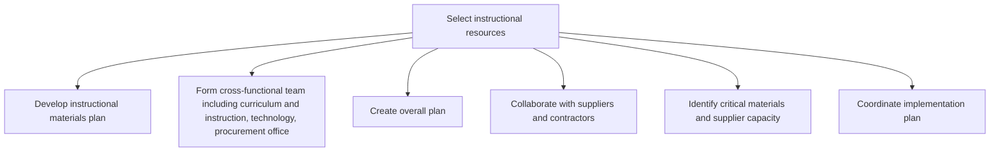

# Select instructional resources

> TODO: Business-as-Code definition for select instructional resources (education)

## Overview

TODO: Add process overview

## Process Hierarchy



## GraphDL

```yaml
select:
  object: Instructional Resources
  actor: TODO
  result: TODO
```

## Actions

| Action | Description |
|--------|-------------|
| TODO | TODO |

## Events

| Event | Description |
|-------|-------------|
| TODO | TODO |

## Searches

| Search | Description |
|--------|-------------|
| TODO | TODO |

## Process Flow


## RACI Matrix

| Activity | Responsible | Accountable | Consulted | Informed |
|----------|-------------|-------------|-----------|----------|
| TODO | TODO | TODO | TODO | TODO |

## Sub-Processes

| ID | Name | Description |
|----|------|-------------|
| 2.1.6.1 | Develop instructional materials plan | TODO |
| 2.1.6.2 | Form cross-functional team including curriculum and instruction, technology, procurement office | TODO |
| 2.1.6.3 | Create overall plan | TODO |
| 2.1.6.4 | Collaborate with suppliers and contractors | TODO |
| 2.1.6.5 | Identify critical materials and supplier capacity | TODO |
| 2.1.6.6 | Coordinate implementation plan | TODO |

## Related Processes

| Process | Relationship |
|---------|-------------|
| TODO | TODO |

## Related Departments

| Department | Role |
|-----------|------|
| TODO | TODO |

## Related Occupations

| Occupation | Involvement |
|-----------|-------------|
| TODO | TODO |

## KPIs

| KPI | Description | Unit |
|-----|-------------|------|
| TODO | TODO | TODO |

## Usage

```typescript
import { TODO } from '@headlessly/select-instructional-resources'

const client = TODO()

// TODO: Example action calls
```
