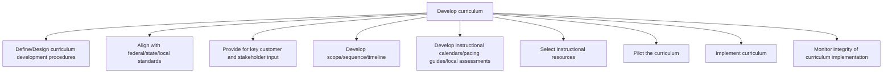

# Develop curriculum

> TODO: Business-as-Code definition for develop curriculum (education)

## Overview

TODO: Add process overview

## Process Hierarchy



## GraphDL

```yaml
develop:
  object: Curriculum
  actor: TODO
  result: TODO
```

## Actions

| Action | Description |
|--------|-------------|
| TODO | TODO |

## Events

| Event | Description |
|-------|-------------|
| TODO | TODO |

## Searches

| Search | Description |
|--------|-------------|
| TODO | TODO |

## Process Flow


## RACI Matrix

| Activity | Responsible | Accountable | Consulted | Informed |
|----------|-------------|-------------|-----------|----------|
| TODO | TODO | TODO | TODO | TODO |

## Sub-Processes

| ID | Name | Description |
|----|------|-------------|
| 2.1.1 | Define/Design curriculum development procedures | TODO |
| 2.1.2 | Align with federal/state/local standards | TODO |
| 2.1.3 | Provide for key customer and stakeholder input | TODO |
| 2.1.4 | Develop scope/sequence/timeline | TODO |
| 2.1.5 | Develop instructional calendars/pacing guides/local assessments | TODO |
| 2.1.6 | Select instructional resources | TODO |
| 2.1.7 | Pilot the curriculum | TODO |
| 2.1.8 | Implement curriculum | TODO |
| 2.1.9 | Monitor integrity of curriculum implementation | TODO |

## Related Processes

| Process | Relationship |
|---------|-------------|
| TODO | TODO |

## Related Departments

| Department | Role |
|-----------|------|
| TODO | TODO |

## Related Occupations

| Occupation | Involvement |
|-----------|-------------|
| TODO | TODO |

## KPIs

| KPI | Description | Unit |
|-----|-------------|------|
| TODO | TODO | TODO |

## Usage

```typescript
import { TODO } from '@headlessly/develop-curriculum'

const client = TODO()

// TODO: Example action calls
```
