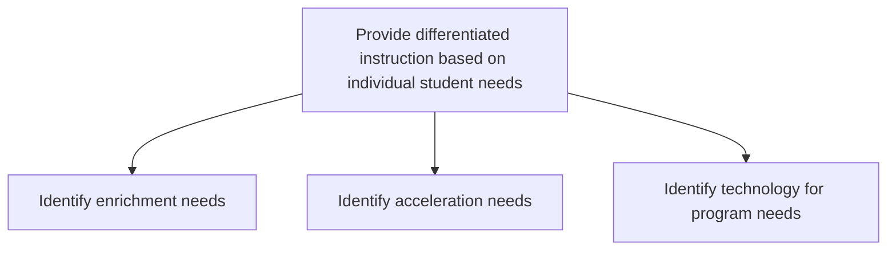

# Provide differentiated instruction based on individual student needs

> TODO: Business-as-Code definition for provide differentiated instruction based on individual student needs (education)

## Overview

TODO: Add process overview

## Process Hierarchy



## GraphDL

```yaml
provide:
  object: Differentiated Instruction Based On Individual Student Needs
  actor: TODO
  result: TODO
```

## Actions

| Action | Description |
|--------|-------------|
| TODO | TODO |

## Events

| Event | Description |
|-------|-------------|
| TODO | TODO |

## Searches

| Search | Description |
|--------|-------------|
| TODO | TODO |

## Process Flow


## RACI Matrix

| Activity | Responsible | Accountable | Consulted | Informed |
|----------|-------------|-------------|-----------|----------|
| TODO | TODO | TODO | TODO | TODO |

## Sub-Processes

| ID | Name | Description |
|----|------|-------------|
| 2.2.6.1 | Identify enrichment needs | TODO |
| 2.2.6.2 | Identify acceleration needs | TODO |
| 2.2.6.3 | Identify technology for program needs | TODO |

## Related Processes

| Process | Relationship |
|---------|-------------|
| TODO | TODO |

## Related Departments

| Department | Role |
|-----------|------|
| TODO | TODO |

## Related Occupations

| Occupation | Involvement |
|-----------|-------------|
| TODO | TODO |

## KPIs

| KPI | Description | Unit |
|-----|-------------|------|
| TODO | TODO | TODO |

## Usage

```typescript
import { TODO } from '@headlessly/provide-differentiated-instruction-based-on-individual-student-needs'

const client = TODO()

// TODO: Example action calls
```
