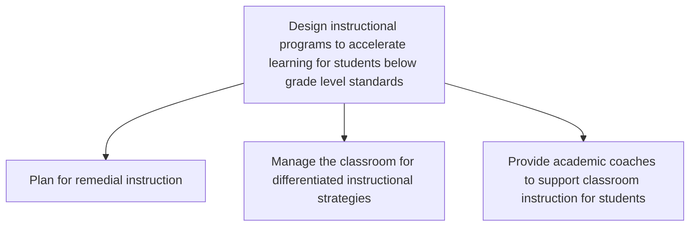

# Design instructional programs to accelerate learning for students below grade level standards

> TODO: Business-as-Code definition for design instructional programs to accelerate learning for students below grade level standards (education)

## Overview

TODO: Add process overview

## Process Hierarchy



## GraphDL

```yaml
design:
  object: Instructional Programs To Accelerate Learning For Students Below Grade Level Standards
  actor: TODO
  result: TODO
```

## Actions

| Action | Description |
|--------|-------------|
| TODO | TODO |

## Events

| Event | Description |
|-------|-------------|
| TODO | TODO |

## Searches

| Search | Description |
|--------|-------------|
| TODO | TODO |

## Process Flow


## RACI Matrix

| Activity | Responsible | Accountable | Consulted | Informed |
|----------|-------------|-------------|-----------|----------|
| TODO | TODO | TODO | TODO | TODO |

## Sub-Processes

| ID | Name | Description |
|----|------|-------------|
| 2.2.8.1 | Plan for remedial instruction | TODO |
| 2.2.8.2 | Manage the classroom for differentiated instructional strategies | TODO |
| 2.2.8.3 | Provide academic coaches to support classroom instruction for students | TODO |

## Related Processes

| Process | Relationship |
|---------|-------------|
| TODO | TODO |

## Related Departments

| Department | Role |
|-----------|------|
| TODO | TODO |

## Related Occupations

| Occupation | Involvement |
|-----------|-------------|
| TODO | TODO |

## KPIs

| KPI | Description | Unit |
|-----|-------------|------|
| TODO | TODO | TODO |

## Usage

```typescript
import { TODO } from '@headlessly/design-instructional-programs-to-accelerate-learning-for-students-below-grade-level-standards'

const client = TODO()

// TODO: Example action calls
```
