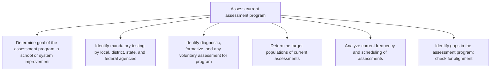

# Assess current assessment program

> TODO: Business-as-Code definition for assess current assessment program (education)

## Overview

TODO: Add process overview

## Process Hierarchy



## GraphDL

```yaml
assess:
  object: Current Assessment Program
  actor: TODO
  result: TODO
```

## Actions

| Action | Description |
|--------|-------------|
| TODO | TODO |

## Events

| Event | Description |
|-------|-------------|
| TODO | TODO |

## Searches

| Search | Description |
|--------|-------------|
| TODO | TODO |

## Process Flow


## RACI Matrix

| Activity | Responsible | Accountable | Consulted | Informed |
|----------|-------------|-------------|-----------|----------|
| TODO | TODO | TODO | TODO | TODO |

## Sub-Processes

| ID | Name | Description |
|----|------|-------------|
| 2.3.1.1.1 | Determine goal of the assessment program in school or system improvement | TODO |
| 2.3.1.1.2 | Identify mandatory testing by local, district, state, and federal agencies | TODO |
| 2.3.1.1.3 | Identify diagnostic, formative, and any voluntary assessment for program | TODO |
| 2.3.1.1.4 | Determine target populations of current assessments | TODO |
| 2.3.1.1.5 | Analyze current frequency and scheduling of assessments | TODO |
| 2.3.1.1.6 | Identify gaps in the assessment program; check for alignment | TODO |

## Related Processes

| Process | Relationship |
|---------|-------------|
| TODO | TODO |

## Related Departments

| Department | Role |
|-----------|------|
| TODO | TODO |

## Related Occupations

| Occupation | Involvement |
|-----------|-------------|
| TODO | TODO |

## KPIs

| KPI | Description | Unit |
|-----|-------------|------|
| TODO | TODO | TODO |

## Usage

```typescript
import { TODO } from '@headlessly/assess-current-assessment-program'

const client = TODO()

// TODO: Example action calls
```
