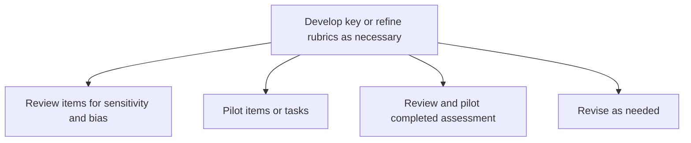

# Develop key or refine rubrics as necessary

> TODO: Business-as-Code definition for develop key or refine rubrics as necessary (education)

## Overview

TODO: Add process overview

## Process Hierarchy



## GraphDL

```yaml
develop:
  object: Key Or Refine Rubrics As Necessary
  actor: TODO
  result: TODO
```

## Actions

| Action | Description |
|--------|-------------|
| TODO | TODO |

## Events

| Event | Description |
|-------|-------------|
| TODO | TODO |

## Searches

| Search | Description |
|--------|-------------|
| TODO | TODO |

## Process Flow


## RACI Matrix

| Activity | Responsible | Accountable | Consulted | Informed |
|----------|-------------|-------------|-----------|----------|
| TODO | TODO | TODO | TODO | TODO |

## Sub-Processes

| ID | Name | Description |
|----|------|-------------|
| 2.3.2.9.1 | Review items for sensitivity and bias | TODO |
| 2.3.2.9.2 | Pilot items or tasks | TODO |
| 2.3.2.9.3 | Review and pilot completed assessment | TODO |
| 2.3.2.9.4 | Revise as needed | TODO |

## Related Processes

| Process | Relationship |
|---------|-------------|
| TODO | TODO |

## Related Departments

| Department | Role |
|-----------|------|
| TODO | TODO |

## Related Occupations

| Occupation | Involvement |
|-----------|-------------|
| TODO | TODO |

## KPIs

| KPI | Description | Unit |
|-----|-------------|------|
| TODO | TODO | TODO |

## Usage

```typescript
import { TODO } from '@headlessly/develop-key-or-refine-rubrics-as-necessary'

const client = TODO()

// TODO: Example action calls
```
