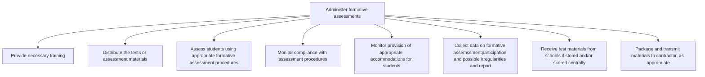

# Administer formative assessments

> TODO: Business-as-Code definition for administer formative assessments (education)

## Overview

TODO: Add process overview

## Process Hierarchy



## GraphDL

```yaml
administer:
  object: Formative Assessments
  actor: TODO
  result: TODO
```

## Actions

| Action | Description |
|--------|-------------|
| TODO | TODO |

## Events

| Event | Description |
|-------|-------------|
| TODO | TODO |

## Searches

| Search | Description |
|--------|-------------|
| TODO | TODO |

## Process Flow


## RACI Matrix

| Activity | Responsible | Accountable | Consulted | Informed |
|----------|-------------|-------------|-----------|----------|
| TODO | TODO | TODO | TODO | TODO |

## Sub-Processes

| ID | Name | Description |
|----|------|-------------|
| 2.3.3.1 | Provide necessary training | TODO |
| 2.3.3.2 | Distribute the tests or assessment materials | TODO |
| 2.3.3.3 | Assess students using appropriate formative assessment procedures | TODO |
| 2.3.3.4 | Monitor compliance with assessment procedures | TODO |
| 2.3.3.5 | Monitor provision of appropriate accommodations for students | TODO |
| 2.3.3.6 | Collect data on formative assemssmentparticipation and possible irregularities and report | TODO |
| 2.3.3.7 | Receive test materials from schools if stored and/or scored centrally | TODO |
| 2.3.3.8 | Package and transmit materials to contractor, as appropriate | TODO |

## Related Processes

| Process | Relationship |
|---------|-------------|
| TODO | TODO |

## Related Departments

| Department | Role |
|-----------|------|
| TODO | TODO |

## Related Occupations

| Occupation | Involvement |
|-----------|-------------|
| TODO | TODO |

## KPIs

| KPI | Description | Unit |
|-----|-------------|------|
| TODO | TODO | TODO |

## Usage

```typescript
import { TODO } from '@headlessly/administer-formative-assessments'

const client = TODO()

// TODO: Example action calls
```
