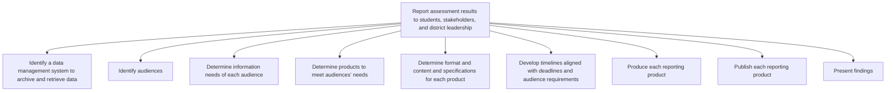

# Report assessment results to students, stakeholders, and district leadership

> TODO: Business-as-Code definition for report assessment results to students, stakeholders, and district leadership (education)

## Overview

TODO: Add process overview

## Process Hierarchy



## GraphDL

```yaml
report:
  object: Assessment Results To Students, Stakeholders, And District Leadership
  actor: TODO
  result: TODO
```

## Actions

| Action | Description |
|--------|-------------|
| TODO | TODO |

## Events

| Event | Description |
|-------|-------------|
| TODO | TODO |

## Searches

| Search | Description |
|--------|-------------|
| TODO | TODO |

## Process Flow


## RACI Matrix

| Activity | Responsible | Accountable | Consulted | Informed |
|----------|-------------|-------------|-----------|----------|
| TODO | TODO | TODO | TODO | TODO |

## Sub-Processes

| ID | Name | Description |
|----|------|-------------|
| 2.3.8.1 | Identify a data management system to archive and retrieve data | TODO |
| 2.3.8.2 | Identify audiences | TODO |
| 2.3.8.3 | Determine information needs of each audience | TODO |
| 2.3.8.4 | Determine products to meet audiences’ needs | TODO |
| 2.3.8.5 | Determine format and content and specifications for each product | TODO |
| 2.3.8.6 | Develop timelines aligned with deadlines and audience requirements | TODO |
| 2.3.8.7 | Produce each reporting product | TODO |
| 2.3.8.8 | Publish each reporting product | TODO |
| 2.3.8.9 | Present findings | TODO |

## Related Processes

| Process | Relationship |
|---------|-------------|
| TODO | TODO |

## Related Departments

| Department | Role |
|-----------|------|
| TODO | TODO |

## Related Occupations

| Occupation | Involvement |
|-----------|-------------|
| TODO | TODO |

## KPIs

| KPI | Description | Unit |
|-----|-------------|------|
| TODO | TODO | TODO |

## Usage

```typescript
import { TODO } from '@headlessly/report-assessment-results-to-students,-stakeholders,-and-district-leadership'

const client = TODO()

// TODO: Example action calls
```
