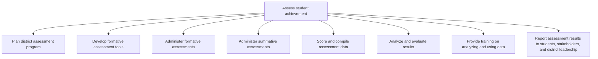

# Assess student achievement

> TODO: Business-as-Code definition for assess student achievement (education)

## Overview

TODO: Add process overview

## Process Hierarchy



## GraphDL

```yaml
assess:
  object: Student Achievement
  actor: TODO
  result: TODO
```

## Actions

| Action | Description |
|--------|-------------|
| TODO | TODO |

## Events

| Event | Description |
|-------|-------------|
| TODO | TODO |

## Searches

| Search | Description |
|--------|-------------|
| TODO | TODO |

## Process Flow


## RACI Matrix

| Activity | Responsible | Accountable | Consulted | Informed |
|----------|-------------|-------------|-----------|----------|
| TODO | TODO | TODO | TODO | TODO |

## Sub-Processes

| ID | Name | Description |
|----|------|-------------|
| 2.3.1 | Plan district assessment program | TODO |
| 2.3.2 | Develop formative assessment tools | TODO |
| 2.3.3 | Administer formative assessments | TODO |
| 2.3.4 | Administer summative assessments | TODO |
| 2.3.5 | Score and compile assessment data | TODO |
| 2.3.6 | Analyze and evaluate results | TODO |
| 2.3.7 | Provide training on analyzing and using data | TODO |
| 2.3.8 | Report assessment results to students, stakeholders, and district leadership | TODO |

## Related Processes

| Process | Relationship |
|---------|-------------|
| TODO | TODO |

## Related Departments

| Department | Role |
|-----------|------|
| TODO | TODO |

## Related Occupations

| Occupation | Involvement |
|-----------|-------------|
| TODO | TODO |

## KPIs

| KPI | Description | Unit |
|-----|-------------|------|
| TODO | TODO | TODO |

## Usage

```typescript
import { TODO } from '@headlessly/assess-student-achievement'

const client = TODO()

// TODO: Example action calls
```
