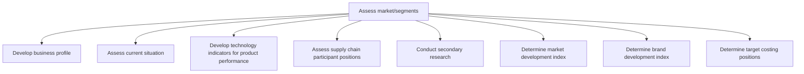

# Assess market/segments

> TODO: Business-as-Code definition for assess market/segments (automotive)

## Overview

TODO: Add process overview

## Process Hierarchy



## GraphDL

```yaml
assess:
  object: Market/segments
  actor: TODO
  result: TODO
```

## Actions

| Action | Description |
|--------|-------------|
| TODO | TODO |

## Events

| Event | Description |
|-------|-------------|
| TODO | TODO |

## Searches

| Search | Description |
|--------|-------------|
| TODO | TODO |

## Process Flow


## RACI Matrix

| Activity | Responsible | Accountable | Consulted | Informed |
|----------|-------------|-------------|-----------|----------|
| TODO | TODO | TODO | TODO | TODO |

## Sub-Processes

| ID | Name | Description |
|----|------|-------------|
| 2.1.2.1 | Develop business profile | TODO |
| 2.1.2.2 | Assess current situation | TODO |
| 2.1.2.3 | Develop technology indicators for product performance | TODO |
| 2.1.2.4 | Assess supply chain participant positions | TODO |
| 2.1.2.5 | Conduct secondary research | TODO |
| 2.1.2.6 | Determine market development index | TODO |
| 2.1.2.7 | Determine brand development index | TODO |
| 2.1.2.8 | Determine target costing positions | TODO |

## Related Processes

| Process | Relationship |
|---------|-------------|
| TODO | TODO |

## Related Departments

| Department | Role |
|-----------|------|
| TODO | TODO |

## Related Occupations

| Occupation | Involvement |
|-----------|-------------|
| TODO | TODO |

## KPIs

| KPI | Description | Unit |
|-----|-------------|------|
| TODO | TODO | TODO |

## Usage

```typescript
import { TODO } from '@headlessly/assess-market/segments'

const client = TODO()

// TODO: Example action calls
```
