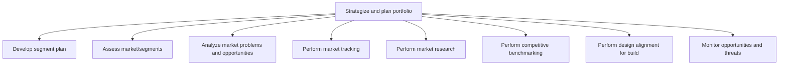

# Strategize and plan portfolio

> TODO: Business-as-Code definition for strategize and plan portfolio (automotive)

## Overview

The first two processes in “strategize and plan portfolio” address developing a market segment plan and assessing the segments to enable the determination of target costing positions. Based on the cost of individual design items, the overall segment profitability can be determined. Next, the market problems and opportunities are analyzed, market tracking and competitive benchmarking is performed, and the design is aligned for the build of the vehicle. This includes deciding which parts are to be commoditized (a commoditized part is one that can become standard across many cars e.g. tires), and determining the modular design. The modular design refers to the sub-assembly of unique and commoditized parts. Finally, market opportunities and threats are monitored on an ongoing basis.

## Process Hierarchy



## GraphDL

```yaml
strategize:
  object: And Plan Portfolio
  actor: TODO
  result: TODO
```

## Actions

| Action | Description |
|--------|-------------|
| TODO | TODO |

## Events

| Event | Description |
|-------|-------------|
| TODO | TODO |

## Searches

| Search | Description |
|--------|-------------|
| TODO | TODO |

## Process Flow


## RACI Matrix

| Activity | Responsible | Accountable | Consulted | Informed |
|----------|-------------|-------------|-----------|----------|
| TODO | TODO | TODO | TODO | TODO |

## Sub-Processes

| ID | Name | Description |
|----|------|-------------|
| 2.1.1 | Develop segment plan | TODO |
| 2.1.2 | Assess market/segments | TODO |
| 2.1.3 | Analyze market problems and opportunities | TODO |
| 2.1.4 | Perform market tracking | TODO |
| 2.1.5 | Perform market research | TODO |
| 2.1.6 | Perform competitive benchmarking | TODO |
| 2.1.7 | Perform design alignment for build | TODO |
| 2.1.8 | Monitor opportunities and threats | TODO |

## Related Processes

| Process | Relationship |
|---------|-------------|
| TODO | TODO |

## Related Departments

| Department | Role |
|-----------|------|
| TODO | TODO |

## Related Occupations

| Occupation | Involvement |
|-----------|-------------|
| TODO | TODO |

## KPIs

| KPI | Description | Unit |
|-----|-------------|------|
| TODO | TODO | TODO |

## Usage

```typescript
import { TODO } from '@headlessly/strategize-and-plan-portfolio'

const client = TODO()

// TODO: Example action calls
```
