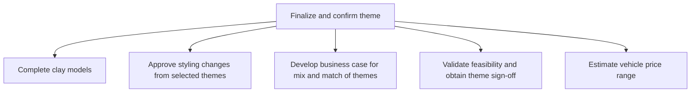

# Finalize and confirm theme

> TODO: Business-as-Code definition for finalize and confirm theme (automotive)

## Overview

TODO: Add process overview

## Process Hierarchy



## GraphDL

```yaml
finalize:
  object: And Confirm Theme
  actor: TODO
  result: TODO
```

## Actions

| Action | Description |
|--------|-------------|
| TODO | TODO |

## Events

| Event | Description |
|-------|-------------|
| TODO | TODO |

## Searches

| Search | Description |
|--------|-------------|
| TODO | TODO |

## Process Flow


## RACI Matrix

| Activity | Responsible | Accountable | Consulted | Informed |
|----------|-------------|-------------|-----------|----------|
| TODO | TODO | TODO | TODO | TODO |

## Sub-Processes

| ID | Name | Description |
|----|------|-------------|
| 2.2.5.1 | Complete clay models | TODO |
| 2.2.5.2 | Approve styling changes from selected themes | TODO |
| 2.2.5.3 | Develop business case for mix and match of themes | TODO |
| 2.2.5.4 | Validate feasibility and obtain theme sign-off | TODO |
| 2.2.5.5 | Estimate vehicle price range | TODO |

## Related Processes

| Process | Relationship |
|---------|-------------|
| TODO | TODO |

## Related Departments

| Department | Role |
|-----------|------|
| TODO | TODO |

## Related Occupations

| Occupation | Involvement |
|-----------|-------------|
| TODO | TODO |

## KPIs

| KPI | Description | Unit |
|-----|-------------|------|
| TODO | TODO | TODO |

## Usage

```typescript
import { TODO } from '@headlessly/finalize-and-confirm-theme'

const client = TODO()

// TODO: Example action calls
```
