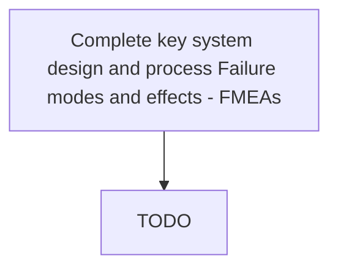

# Complete key system design and process Failure modes and effects - FMEAs

> TODO: Business-as-Code definition for complete key system design and process failure modes and effects - fmeas (automotive)

## Overview

TODO: Add process overview

## Process Hierarchy



## GraphDL

```yaml
complete:
  object: Key System Design And Process Failure Modes And Effects - FMEAs
  actor: TODO
  result: TODO
```

## Actions

| Action | Description |
|--------|-------------|
| TODO | TODO |

## Events

| Event | Description |
|-------|-------------|
| TODO | TODO |

## Searches

| Search | Description |
|--------|-------------|
| TODO | TODO |

## Process Flow


## RACI Matrix

| Activity | Responsible | Accountable | Consulted | Informed |
|----------|-------------|-------------|-----------|----------|
| TODO | TODO | TODO | TODO | TODO |

## Related Processes

| Process | Relationship |
|---------|-------------|
| TODO | TODO |

## Related Departments

| Department | Role |
|-----------|------|
| TODO | TODO |

## Related Occupations

| Occupation | Involvement |
|-----------|-------------|
| TODO | TODO |

## KPIs

| KPI | Description | Unit |
|-----|-------------|------|
| TODO | TODO | TODO |

## Usage

```typescript
import { TODO } from '@headlessly/complete-key-system-design-and-process-failure-modes-and-effects---fmeas'

const client = TODO()

// TODO: Example action calls
```
