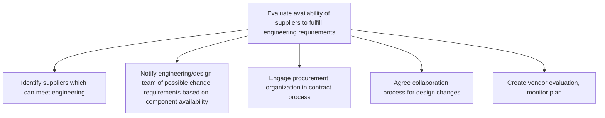

# Evaluate availability of suppliers to fulfill engineering requirements

> TODO: Business-as-Code definition for evaluate availability of suppliers to fulfill engineering requirements (automotive)

## Overview

TODO: Add process overview

## Process Hierarchy



## GraphDL

```yaml
evaluate:
  object: Availability Of Suppliers To Fulfill Engineering Requirements
  actor: TODO
  result: TODO
```

## Actions

| Action | Description |
|--------|-------------|
| TODO | TODO |

## Events

| Event | Description |
|-------|-------------|
| TODO | TODO |

## Searches

| Search | Description |
|--------|-------------|
| TODO | TODO |

## Process Flow


## RACI Matrix

| Activity | Responsible | Accountable | Consulted | Informed |
|----------|-------------|-------------|-----------|----------|
| TODO | TODO | TODO | TODO | TODO |

## Sub-Processes

| ID | Name | Description |
|----|------|-------------|
| 2.3.2.1 | Identify suppliers which can meet engineering | TODO |
| 2.3.2.2 | Notify engineering/design team of possible change requirements based on component availability | TODO |
| 2.3.2.3 | Engage procurement organization in contract process | TODO |
| 2.3.2.4 | Agree collaboration process for design changes | TODO |
| 2.3.2.5 | Create vendor evaluation, monitor plan | TODO |

## Related Processes

| Process | Relationship |
|---------|-------------|
| TODO | TODO |

## Related Departments

| Department | Role |
|-----------|------|
| TODO | TODO |

## Related Occupations

| Occupation | Involvement |
|-----------|-------------|
| TODO | TODO |

## KPIs

| KPI | Description | Unit |
|-----|-------------|------|
| TODO | TODO | TODO |

## Usage

```typescript
import { TODO } from '@headlessly/evaluate-availability-of-suppliers-to-fulfill-engineering-requirements'

const client = TODO()

// TODO: Example action calls
```
