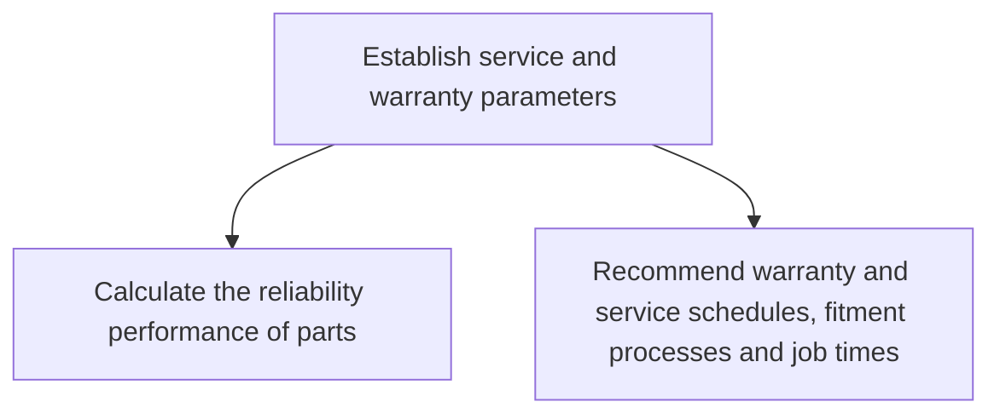

# Establish service and warranty parameters

> TODO: Business-as-Code definition for establish service and warranty parameters (automotive)

## Overview

TODO: Add process overview

## Process Hierarchy



## GraphDL

```yaml
establish:
  object: Service And Warranty Parameters
  actor: TODO
  result: TODO
```

## Actions

| Action | Description |
|--------|-------------|
| TODO | TODO |

## Events

| Event | Description |
|-------|-------------|
| TODO | TODO |

## Searches

| Search | Description |
|--------|-------------|
| TODO | TODO |

## Process Flow


## RACI Matrix

| Activity | Responsible | Accountable | Consulted | Informed |
|----------|-------------|-------------|-----------|----------|
| TODO | TODO | TODO | TODO | TODO |

## Sub-Processes

| ID | Name | Description |
|----|------|-------------|
| 2.3.7.1 | Calculate the reliability performance of parts | TODO |
| 2.3.7.2 | Recommend warranty and service schedules, fitment processes and job times | TODO |

## Related Processes

| Process | Relationship |
|---------|-------------|
| TODO | TODO |

## Related Departments

| Department | Role |
|-----------|------|
| TODO | TODO |

## Related Occupations

| Occupation | Involvement |
|-----------|-------------|
| TODO | TODO |

## KPIs

| KPI | Description | Unit |
|-----|-------------|------|
| TODO | TODO | TODO |

## Usage

```typescript
import { TODO } from '@headlessly/establish-service-and-warranty-parameters'

const client = TODO()

// TODO: Example action calls
```
