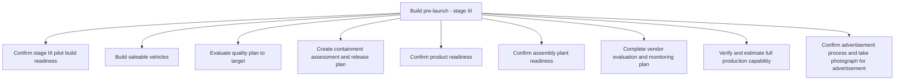

# Build pre-launch - stage III

> TODO: Business-as-Code definition for build pre-launch - stage iii (automotive)

## Overview

TODO: Add process overview

## Process Hierarchy



## GraphDL

```yaml
build:
  object: Pre-launch - Stage III
  actor: TODO
  result: TODO
```

## Actions

| Action | Description |
|--------|-------------|
| TODO | TODO |

## Events

| Event | Description |
|-------|-------------|
| TODO | TODO |

## Searches

| Search | Description |
|--------|-------------|
| TODO | TODO |

## Process Flow


## RACI Matrix

| Activity | Responsible | Accountable | Consulted | Informed |
|----------|-------------|-------------|-----------|----------|
| TODO | TODO | TODO | TODO | TODO |

## Sub-Processes

| ID | Name | Description |
|----|------|-------------|
| 2.5.3.1 | Confirm stage III pilot build readiness | TODO |
| 2.5.3.2 | Build saleable vehicles | TODO |
| 2.5.3.3 | Evaluate quality plan to target | TODO |
| 2.5.3.4 | Create containment assessment and release plan | TODO |
| 2.5.3.5 | Confirm product readiness | TODO |
| 2.5.3.6 | Confirm assembly plant readiness | TODO |
| 2.5.3.7 | Complete vendor evaluation and monitoring plan | TODO |
| 2.5.3.8 | Verify and estimate full production capability | TODO |
| 2.5.3.9 | Confirm advertisement process and take photograph for advertisement | TODO |

## Related Processes

| Process | Relationship |
|---------|-------------|
| TODO | TODO |

## Related Departments

| Department | Role |
|-----------|------|
| TODO | TODO |

## Related Occupations

| Occupation | Involvement |
|-----------|-------------|
| TODO | TODO |

## KPIs

| KPI | Description | Unit |
|-----|-------------|------|
| TODO | TODO | TODO |

## Usage

```typescript
import { TODO } from '@headlessly/build-pre-launch---stage-iii'

const client = TODO()

// TODO: Example action calls
```
