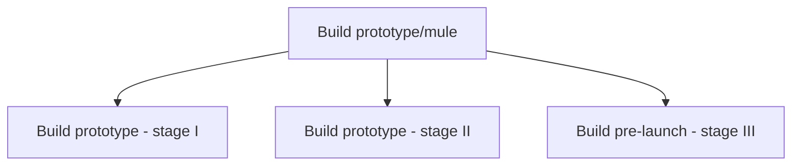

# Build prototype/mule

> TODO: Business-as-Code definition for build prototype/mule (automotive)

## Overview

Once the vehicle has been designed, a prototype or simplified model of the new vehicle is built in three stages. The completed prototype is used to determine whether the final design will be functionally feasible and cost-effective to manufacture. The final stage is called the pre-launch build, and it completes with the confirmation of the advertisement process and takes a photograph of the vehicle for the advertisement.

## Process Hierarchy



## GraphDL

```yaml
build:
  object: Prototype/mule
  actor: TODO
  result: TODO
```

## Actions

| Action | Description |
|--------|-------------|
| TODO | TODO |

## Events

| Event | Description |
|-------|-------------|
| TODO | TODO |

## Searches

| Search | Description |
|--------|-------------|
| TODO | TODO |

## Process Flow


## RACI Matrix

| Activity | Responsible | Accountable | Consulted | Informed |
|----------|-------------|-------------|-----------|----------|
| TODO | TODO | TODO | TODO | TODO |

## Sub-Processes

| ID | Name | Description |
|----|------|-------------|
| 2.5.1 | Build prototype - stage I | TODO |
| 2.5.2 | Build prototype - stage II | TODO |
| 2.5.3 | Build pre-launch - stage III | TODO |

## Related Processes

| Process | Relationship |
|---------|-------------|
| TODO | TODO |

## Related Departments

| Department | Role |
|-----------|------|
| TODO | TODO |

## Related Occupations

| Occupation | Involvement |
|-----------|-------------|
| TODO | TODO |

## KPIs

| KPI | Description | Unit |
|-----|-------------|------|
| TODO | TODO | TODO |

## Usage

```typescript
import { TODO } from '@headlessly/build-prototype/mule'

const client = TODO()

// TODO: Example action calls
```
