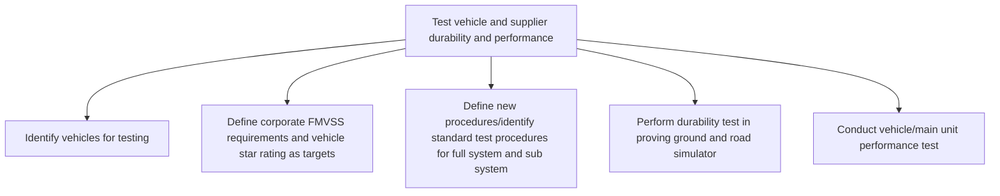

# Test vehicle and supplier durability and performance

> TODO: Business-as-Code definition for test vehicle and supplier durability and performance (automotive)

## Overview

TODO: Add process overview

## Process Hierarchy



## GraphDL

```yaml
test:
  object: Vehicle And Supplier Durability And Performance
  actor: TODO
  result: TODO
```

## Actions

| Action | Description |
|--------|-------------|
| TODO | TODO |

## Events

| Event | Description |
|-------|-------------|
| TODO | TODO |

## Searches

| Search | Description |
|--------|-------------|
| TODO | TODO |

## Process Flow


## RACI Matrix

| Activity | Responsible | Accountable | Consulted | Informed |
|----------|-------------|-------------|-----------|----------|
| TODO | TODO | TODO | TODO | TODO |

## Sub-Processes

| ID | Name | Description |
|----|------|-------------|
| 2.6.1.1 | Identify vehicles for testing | TODO |
| 2.6.1.2 | Define corporate FMVSS requirements and vehicle star rating as targets | TODO |
| 2.6.1.3 | Define new procedures/identify standard test procedures for full system and sub system | TODO |
| 2.6.1.4 | Perform durability test in proving ground and road simulator | TODO |
| 2.6.1.5 | Conduct vehicle/main unit performance test | TODO |

## Related Processes

| Process | Relationship |
|---------|-------------|
| TODO | TODO |

## Related Departments

| Department | Role |
|-----------|------|
| TODO | TODO |

## Related Occupations

| Occupation | Involvement |
|-----------|-------------|
| TODO | TODO |

## KPIs

| KPI | Description | Unit |
|-----|-------------|------|
| TODO | TODO | TODO |

## Usage

```typescript
import { TODO } from '@headlessly/test-vehicle-and-supplier-durability-and-performance'

const client = TODO()

// TODO: Example action calls
```
