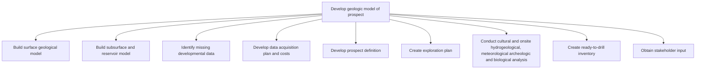

# Develop geologic model of prospect

> TODO: Business-as-Code definition for develop geologic model of prospect (petroleum-upstream)

## Overview

TODO: Add process overview

## Process Hierarchy



## GraphDL

```yaml
develop:
  object: Geologic Model Of Prospect
  actor: TODO
  result: TODO
```

## Actions

| Action | Description |
|--------|-------------|
| TODO | TODO |

## Events

| Event | Description |
|-------|-------------|
| TODO | TODO |

## Searches

| Search | Description |
|--------|-------------|
| TODO | TODO |

## Process Flow


## RACI Matrix

| Activity | Responsible | Accountable | Consulted | Informed |
|----------|-------------|-------------|-----------|----------|
| TODO | TODO | TODO | TODO | TODO |

## Sub-Processes

| ID | Name | Description |
|----|------|-------------|
| 3.2.6.1 | Build surface geological model | TODO |
| 3.2.6.2 | Build subsurface and reservoir model | TODO |
| 3.2.6.3 | Identify missing developmental data | TODO |
| 3.2.6.4 | Develop data acquisition plan and costs | TODO |
| 3.2.6.5 | Develop prospect definition | TODO |
| 3.2.6.6 | Create exploration plan | TODO |
| 3.2.6.7 | Conduct cultural and onsite hydrogeological, meteorological archeologic and biological analysis | TODO |
| 3.2.6.8 | Create ready-to-drill inventory | TODO |
| 3.2.6.9 | Obtain stakeholder input | TODO |

## Related Processes

| Process | Relationship |
|---------|-------------|
| TODO | TODO |

## Related Departments

| Department | Role |
|-----------|------|
| TODO | TODO |

## Related Occupations

| Occupation | Involvement |
|-----------|-------------|
| TODO | TODO |

## KPIs

| KPI | Description | Unit |
|-----|-------------|------|
| TODO | TODO | TODO |

## Usage

```typescript
import { TODO } from '@headlessly/develop-geologic-model-of-prospect'

const client = TODO()

// TODO: Example action calls
```
