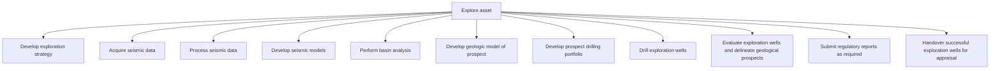

# Explore asset

> TODO: Business-as-Code definition for explore asset (petroleum-upstream)

## Overview

TODO: Add process overview

## Process Hierarchy



## GraphDL

```yaml
explore:
  object: Asset
  actor: TODO
  result: TODO
```

## Actions

| Action | Description |
|--------|-------------|
| TODO | TODO |

## Events

| Event | Description |
|-------|-------------|
| TODO | TODO |

## Searches

| Search | Description |
|--------|-------------|
| TODO | TODO |

## Process Flow


## RACI Matrix

| Activity | Responsible | Accountable | Consulted | Informed |
|----------|-------------|-------------|-----------|----------|
| TODO | TODO | TODO | TODO | TODO |

## Sub-Processes

| ID | Name | Description |
|----|------|-------------|
| 3.2.1 | Develop exploration strategy | TODO |
| 3.2.2 | Acquire seismic data | TODO |
| 3.2.3 | Process seismic data | TODO |
| 3.2.4 | Develop seismic models | TODO |
| 3.2.5 | Perform basin analysis | TODO |
| 3.2.6 | Develop geologic model of prospect | TODO |
| 3.2.7 | Develop prospect drilling portfolio | TODO |
| 3.2.8 | Drill exploration wells | TODO |
| 3.2.9 | Evaluate exploration wells and delineate geological prospects | TODO |
| 3.2.10 | Submit regulatory reports as required | TODO |
| 3.2.11 | Handover successful exploration wells for appraisal | TODO |

## Related Processes

| Process | Relationship |
|---------|-------------|
| TODO | TODO |

## Related Departments

| Department | Role |
|-----------|------|
| TODO | TODO |

## Related Occupations

| Occupation | Involvement |
|-----------|-------------|
| TODO | TODO |

## KPIs

| KPI | Description | Unit |
|-----|-------------|------|
| TODO | TODO | TODO |

## Usage

```typescript
import { TODO } from '@headlessly/explore-asset'

const client = TODO()

// TODO: Example action calls
```
