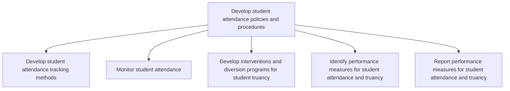

# Develop student attendance policies and procedures

> TODO: Business-as-Code definition for develop student attendance policies and procedures (education)

## Overview

TODO: Add process overview

## Process Hierarchy



## GraphDL

```yaml
develop:
  object: Student Attendance Policies And Procedures
  actor: TODO
  result: TODO
```

## Actions

| Action | Description |
|--------|-------------|
| TODO | TODO |

## Events

| Event | Description |
|-------|-------------|
| TODO | TODO |

## Searches

| Search | Description |
|--------|-------------|
| TODO | TODO |

## Process Flow


## RACI Matrix

| Activity | Responsible | Accountable | Consulted | Informed |
|----------|-------------|-------------|-----------|----------|
| TODO | TODO | TODO | TODO | TODO |

## Sub-Processes

| ID | Name | Description |
|----|------|-------------|
| 3.9.3.1 | Develop student attendance tracking methods | TODO |
| 3.9.3.2 | Monitor student attendance | TODO |
| 3.9.3.3 | Develop interventions and diversion programs for student truancy | TODO |
| 3.9.3.4 | Identify performance measures for student attendance and truancy | TODO |
| 3.9.3.5 | Report performance measures for student attendance and truancy | TODO |

## Related Processes

| Process | Relationship |
|---------|-------------|
| TODO | TODO |

## Related Departments

| Department | Role |
|-----------|------|
| TODO | TODO |

## Related Occupations

| Occupation | Involvement |
|-----------|-------------|
| TODO | TODO |

## KPIs

| KPI | Description | Unit |
|-----|-------------|------|
| TODO | TODO | TODO |

## Usage

```typescript
import { TODO } from '@headlessly/develop-student-attendance-policies-and-procedures'

const client = TODO()

// TODO: Example action calls
```
