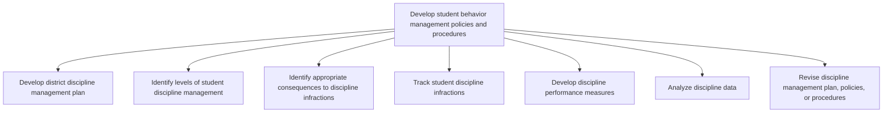

# Develop student behavior management policies and procedures

> TODO: Business-as-Code definition for develop student behavior management policies and procedures (education)

## Overview

TODO: Add process overview

## Process Hierarchy



## GraphDL

```yaml
develop:
  object: Student Behavior Management Policies And Procedures
  actor: TODO
  result: TODO
```

## Actions

| Action | Description |
|--------|-------------|
| TODO | TODO |

## Events

| Event | Description |
|-------|-------------|
| TODO | TODO |

## Searches

| Search | Description |
|--------|-------------|
| TODO | TODO |

## Process Flow


## RACI Matrix

| Activity | Responsible | Accountable | Consulted | Informed |
|----------|-------------|-------------|-----------|----------|
| TODO | TODO | TODO | TODO | TODO |

## Sub-Processes

| ID | Name | Description |
|----|------|-------------|
| 3.9.4.1 | Develop district discipline management plan | TODO |
| 3.9.4.2 | Identify levels of student discipline management | TODO |
| 3.9.4.3 | Identify appropriate consequences to discipline infractions | TODO |
| 3.9.4.4 | Track student discipline infractions | TODO |
| 3.9.4.5 | Develop discipline performance measures | TODO |
| 3.9.4.6 | Analyze discipline data | TODO |
| 3.9.4.7 | Revise discipline management plan, policies, or procedures | TODO |

## Related Processes

| Process | Relationship |
|---------|-------------|
| TODO | TODO |

## Related Departments

| Department | Role |
|-----------|------|
| TODO | TODO |

## Related Occupations

| Occupation | Involvement |
|-----------|-------------|
| TODO | TODO |

## KPIs

| KPI | Description | Unit |
|-----|-------------|------|
| TODO | TODO | TODO |

## Usage

```typescript
import { TODO } from '@headlessly/develop-student-behavior-management-policies-and-procedures'

const client = TODO()

// TODO: Example action calls
```
