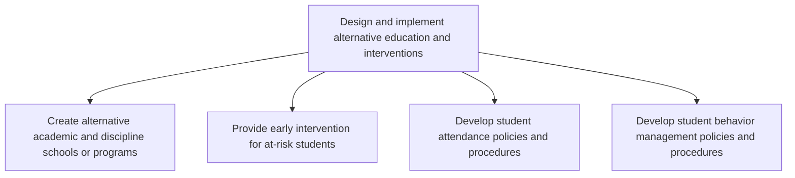

# Design and implement alternative education and interventions

> TODO: Business-as-Code definition for design and implement alternative education and interventions (education)

## Overview

TODO: Add process overview

## Process Hierarchy



## GraphDL

```yaml
design:
  object: And Implement Alternative Education And Interventions
  actor: TODO
  result: TODO
```

## Actions

| Action | Description |
|--------|-------------|
| TODO | TODO |

## Events

| Event | Description |
|-------|-------------|
| TODO | TODO |

## Searches

| Search | Description |
|--------|-------------|
| TODO | TODO |

## Process Flow


## RACI Matrix

| Activity | Responsible | Accountable | Consulted | Informed |
|----------|-------------|-------------|-----------|----------|
| TODO | TODO | TODO | TODO | TODO |

## Sub-Processes

| ID | Name | Description |
|----|------|-------------|
| 3.9.1 | Create alternative academic and discipline schools or programs | TODO |
| 3.9.2 | Provide early intervention for at-risk students | TODO |
| 3.9.3 | Develop student attendance policies and procedures | TODO |
| 3.9.4 | Develop student behavior management policies and procedures | TODO |

## Related Processes

| Process | Relationship |
|---------|-------------|
| TODO | TODO |

## Related Departments

| Department | Role |
|-----------|------|
| TODO | TODO |

## Related Occupations

| Occupation | Involvement |
|-----------|-------------|
| TODO | TODO |

## KPIs

| KPI | Description | Unit |
|-----|-------------|------|
| TODO | TODO | TODO |

## Usage

```typescript
import { TODO } from '@headlessly/design-and-implement-alternative-education-and-interventions'

const client = TODO()

// TODO: Example action calls
```
