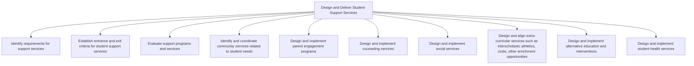

# Design and Deliver Student Support Services

> TODO: Business-as-Code definition for design and deliver student support services (education)

## Overview

TODO: Add process overview

## Process Hierarchy



## GraphDL

```yaml
design:
  object: And Deliver Student Support Services
  actor: TODO
  result: TODO
```

## Actions

| Action | Description |
|--------|-------------|
| TODO | TODO |

## Events

| Event | Description |
|-------|-------------|
| TODO | TODO |

## Searches

| Search | Description |
|--------|-------------|
| TODO | TODO |

## Process Flow


## RACI Matrix

| Activity | Responsible | Accountable | Consulted | Informed |
|----------|-------------|-------------|-----------|----------|
| TODO | TODO | TODO | TODO | TODO |

## Sub-Processes

| ID | Name | Description |
|----|------|-------------|
| 3.1 | Identify requirements for support services | TODO |
| 3.2 | Establish entrance and exit criteria for student support services | TODO |
| 3.3 | Evaluate support programs and services | TODO |
| 3.4 | Identify and coordinate community services related to student needs | TODO |
| 3.5 | Design and implement parent engagement programs | TODO |
| 3.6 | Design and implement counseling services | TODO |
| 3.7 | Design and implement social services | TODO |
| 3.8 | Design and align extra-curricular services such as interscholastic athletics, clubs, other enrichment opportunities | TODO |
| 3.9 | Design and implement alternative education and interventions | TODO |
| 3.10 | Design and implement student health services | TODO |

## Related Processes

| Process | Relationship |
|---------|-------------|
| TODO | TODO |

## Related Departments

| Department | Role |
|-----------|------|
| TODO | TODO |

## Related Occupations

| Occupation | Involvement |
|-----------|-------------|
| TODO | TODO |

## KPIs

| KPI | Description | Unit |
|-----|-------------|------|
| TODO | TODO | TODO |

## Usage

```typescript
import { TODO } from '@headlessly/design-and-deliver-student-support-services'

const client = TODO()

// TODO: Example action calls
```
