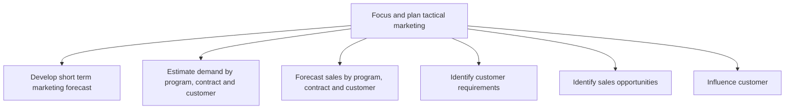

# Focus and plan tactical marketing

> TODO: Business-as-Code definition for focus and plan tactical marketing (aerospace-and-defense)

## Overview

TODO: Add process overview

## Process Hierarchy



## GraphDL

```yaml
focus:
  object: And Plan Tactical Marketing
  actor: TODO
  result: TODO
```

## Actions

| Action | Description |
|--------|-------------|
| TODO | TODO |

## Events

| Event | Description |
|-------|-------------|
| TODO | TODO |

## Searches

| Search | Description |
|--------|-------------|
| TODO | TODO |

## Process Flow


## RACI Matrix

| Activity | Responsible | Accountable | Consulted | Informed |
|----------|-------------|-------------|-----------|----------|
| TODO | TODO | TODO | TODO | TODO |

## Sub-Processes

| ID | Name | Description |
|----|------|-------------|
| 3.3.7.1 | Develop short term marketing forecast | TODO |
| 3.3.7.2 | Estimate demand by program, contract and customer | TODO |
| 3.3.7.3 | Forecast sales by program, contract and customer | TODO |
| 3.3.7.4 | Identify customer requirements | TODO |
| 3.3.7.5 | Identify sales opportunities | TODO |
| 3.3.7.6 | Influence customer | TODO |

## Related Processes

| Process | Relationship |
|---------|-------------|
| TODO | TODO |

## Related Departments

| Department | Role |
|-----------|------|
| TODO | TODO |

## Related Occupations

| Occupation | Involvement |
|-----------|-------------|
| TODO | TODO |

## KPIs

| KPI | Description | Unit |
|-----|-------------|------|
| TODO | TODO | TODO |

## Usage

```typescript
import { TODO } from '@headlessly/focus-and-plan-tactical-marketing'

const client = TODO()

// TODO: Example action calls
```
