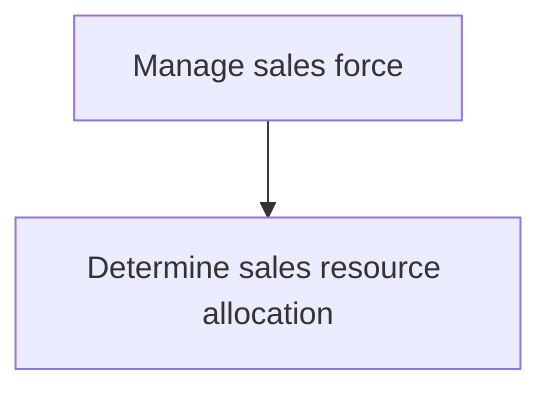

# Manage sales force

> TODO: Business-as-Code definition for manage sales force (aerospace-and-defense)

## Overview

Overseeing the best possible utilization of sales personnel employed by the organization. Deploy staff members to suitable assignments. Create a framework for rewarding and recognizing their efforts.

## Process Hierarchy



## GraphDL

```yaml
manage:
  object: Sales Force
  actor: TODO
  result: TODO
```

## Actions

| Action | Description |
|--------|-------------|
| TODO | TODO |

## Events

| Event | Description |
|-------|-------------|
| TODO | TODO |

## Searches

| Search | Description |
|--------|-------------|
| TODO | TODO |

## Process Flow


## RACI Matrix

| Activity | Responsible | Accountable | Consulted | Informed |
|----------|-------------|-------------|-----------|----------|
| TODO | TODO | TODO | TODO | TODO |

## Sub-Processes

| ID | Name | Description |
|----|------|-------------|
| 3.5.6.1 | Determine sales resource allocation | Planning the distribution of personnel across various sales functions. Match the capabilities of ind |

## Related Processes

| Process | Relationship |
|---------|-------------|
| TODO | TODO |

## Related Departments

| Department | Role |
|-----------|------|
| TODO | TODO |

## Related Occupations

| Occupation | Involvement |
|-----------|-------------|
| TODO | TODO |

## KPIs

| KPI | Description | Unit |
|-----|-------------|------|
| TODO | TODO | TODO |

## Usage

```typescript
import { TODO } from '@headlessly/manage-sales-force'

const client = TODO()

// TODO: Example action calls
```
