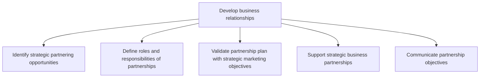

# Develop business relationships

> TODO: Business-as-Code definition for develop business relationships (aerospace-and-defense)

## Overview

TODO: Add process overview

## Process Hierarchy



## GraphDL

```yaml
develop:
  object: Business Relationships
  actor: TODO
  result: TODO
```

## Actions

| Action | Description |
|--------|-------------|
| TODO | TODO |

## Events

| Event | Description |
|-------|-------------|
| TODO | TODO |

## Searches

| Search | Description |
|--------|-------------|
| TODO | TODO |

## Process Flow


## RACI Matrix

| Activity | Responsible | Accountable | Consulted | Informed |
|----------|-------------|-------------|-----------|----------|
| TODO | TODO | TODO | TODO | TODO |

## Sub-Processes

| ID | Name | Description |
|----|------|-------------|
| 3.5.8.1 | Identify strategic partnering opportunities | TODO |
| 3.5.8.2 | Define roles and responsibilities of partnerships | TODO |
| 3.5.8.3 | Validate partnership plan with strategic marketing objectives | TODO |
| 3.5.8.4 | Support strategic business partnerships | TODO |
| 3.5.8.5 | Communicate partnership objectives | TODO |

## Related Processes

| Process | Relationship |
|---------|-------------|
| TODO | TODO |

## Related Departments

| Department | Role |
|-----------|------|
| TODO | TODO |

## Related Occupations

| Occupation | Involvement |
|-----------|-------------|
| TODO | TODO |

## KPIs

| KPI | Description | Unit |
|-----|-------------|------|
| TODO | TODO | TODO |

## Usage

```typescript
import { TODO } from '@headlessly/develop-business-relationships'

const client = TODO()

// TODO: Example action calls
```
