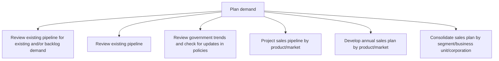

# Plan demand

> TODO: Business-as-Code definition for plan demand (aerospace-and-defense)

## Overview

TODO: Add process overview

## Process Hierarchy



## GraphDL

```yaml
plan:
  object: Demand
  actor: TODO
  result: TODO
```

## Actions

| Action | Description |
|--------|-------------|
| TODO | TODO |

## Events

| Event | Description |
|-------|-------------|
| TODO | TODO |

## Searches

| Search | Description |
|--------|-------------|
| TODO | TODO |

## Process Flow


## RACI Matrix

| Activity | Responsible | Accountable | Consulted | Informed |
|----------|-------------|-------------|-----------|----------|
| TODO | TODO | TODO | TODO | TODO |

## Sub-Processes

| ID | Name | Description |
|----|------|-------------|
| 3.6.1.1 | Review existing pipeline for existing and/or backlog demand | TODO |
| 3.6.1.2 | Review existing pipeline | TODO |
| 3.6.1.3 | Review government trends and check for updates in policies | TODO |
| 3.6.1.4 | Project sales pipeline by product/market | TODO |
| 3.6.1.5 | Develop annual sales plan by product/market | TODO |
| 3.6.1.6 | Consolidate sales plan by segment/business unit/corporation | TODO |

## Related Processes

| Process | Relationship |
|---------|-------------|
| TODO | TODO |

## Related Departments

| Department | Role |
|-----------|------|
| TODO | TODO |

## Related Occupations

| Occupation | Involvement |
|-----------|-------------|
| TODO | TODO |

## KPIs

| KPI | Description | Unit |
|-----|-------------|------|
| TODO | TODO | TODO |

## Usage

```typescript
import { TODO } from '@headlessly/plan-demand'

const client = TODO()

// TODO: Example action calls
```
