# Plan financials

> TODO: Business-as-Code definition for plan financials (aerospace-and-defense)

## Overview

TODO: Add process overview

## Process Hierarchy

```mermaid
graph TD
    A[Plan financials]
    A --> B[Identify cost centers/profit centers/activities/rates]
    A --> C[Create master data]
    A --> D[Calculate direct costs]
    A --> E[Calculate indirect costs]
    A --> F[Project revenues from sales plan]
    A --> G[Prepare projected income statement by legal entity]
    A --> H[Prepare projected income statement by business unit/managers entity]
    A --> I[Prepare projected balance sheet by legal entity]
    A --> J[Prepare projected balance sheet by business unit/managers entity]
    A --> K[Prepare projected cash flow by business unit managers entity]
    A --> L[Prepare projected cash flow by legal entity]
    A --> M[Prepare consolidated income statement]
    A --> N[Prepare consolidated balance sheet]
    A --> O[Prepare consolidated cash flow]
```



## GraphDL

```yaml
plan:
  object: Financials
  actor: TODO
  result: TODO
```

## Actions

| Action | Description |
|--------|-------------|
| TODO | TODO |

## Events

| Event | Description |
|-------|-------------|
| TODO | TODO |

## Searches

| Search | Description |
|--------|-------------|
| TODO | TODO |

## Process Flow


## RACI Matrix

| Activity | Responsible | Accountable | Consulted | Informed |
|----------|-------------|-------------|-----------|----------|
| TODO | TODO | TODO | TODO | TODO |

## Sub-Processes

| ID | Name | Description |
|----|------|-------------|
| 3.6.3.1 | Identify cost centers/profit centers/activities/rates | TODO |
| 3.6.3.2 | Create master data | TODO |
| 3.6.3.3 | Calculate direct costs | TODO |
| 3.6.3.4 | Calculate indirect costs | TODO |
| 3.6.3.5 | Project revenues from sales plan | TODO |
| 3.6.3.6 | Prepare projected income statement by legal entity | TODO |
| 3.6.3.7 | Prepare projected income statement by business unit/managers entity | TODO |
| 3.6.3.8 | Prepare projected balance sheet by legal entity | TODO |
| 3.6.3.9 | Prepare projected balance sheet by business unit/managers entity | TODO |
| 3.6.3.10 | Prepare projected cash flow by business unit managers entity | TODO |
| 3.6.3.11 | Prepare projected cash flow by legal entity | TODO |
| 3.6.3.12 | Prepare consolidated income statement | TODO |
| 3.6.3.13 | Prepare consolidated balance sheet | TODO |
| 3.6.3.14 | Prepare consolidated cash flow | TODO |

## Related Processes

| Process | Relationship |
|---------|-------------|
| TODO | TODO |

## Related Departments

| Department | Role |
|-----------|------|
| TODO | TODO |

## Related Occupations

| Occupation | Involvement |
|-----------|-------------|
| TODO | TODO |

## KPIs

| KPI | Description | Unit |
|-----|-------------|------|
| TODO | TODO | TODO |

## Usage

```typescript
import { TODO } from '@headlessly/plan-financials'

const client = TODO()

// TODO: Example action calls
```
