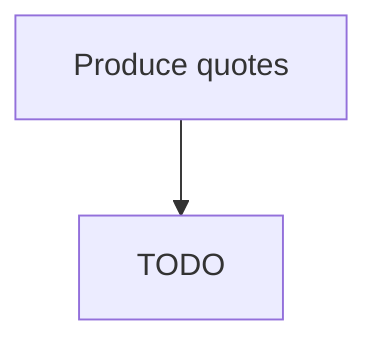

# Produce quotes

> TODO: Business-as-Code definition for produce quotes (aerospace-and-defense)

## Overview

Identifying quote factors.  In order to produce a quote, several factors must be identified and reconciled. What does it cost to get the part? What does it cost to ship to the customer? What is the margin for this customer and part combination? What are competitors charging? Take into consideration the following in order to produce quotes for services, such as field level support: repair service, training, additional tech manuals, etc.

## Process Hierarchy



## GraphDL

```yaml
produce:
  object: Quotes
  actor: TODO
  result: TODO
```

## Actions

| Action | Description |
|--------|-------------|
| TODO | TODO |

## Events

| Event | Description |
|-------|-------------|
| TODO | TODO |

## Searches

| Search | Description |
|--------|-------------|
| TODO | TODO |

## Process Flow


## RACI Matrix

| Activity | Responsible | Accountable | Consulted | Informed |
|----------|-------------|-------------|-----------|----------|
| TODO | TODO | TODO | TODO | TODO |

## Related Processes

| Process | Relationship |
|---------|-------------|
| TODO | TODO |

## Related Departments

| Department | Role |
|-----------|------|
| TODO | TODO |

## Related Occupations

| Occupation | Involvement |
|-----------|-------------|
| TODO | TODO |

## KPIs

| KPI | Description | Unit |
|-----|-------------|------|
| TODO | TODO | TODO |

## Usage

```typescript
import { TODO } from '@headlessly/produce-quotes'

const client = TODO()

// TODO: Example action calls
```
