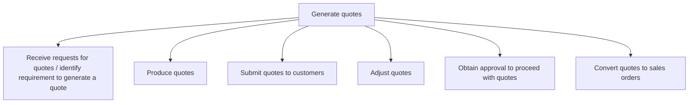

# Generate quotes

> TODO: Business-as-Code definition for generate quotes (aerospace-and-defense)

## Overview

Generating quotes for parts and services. Services include maintenance, parts repairs, digital, etc. Quote activities are also aligned with  Manage customer pricing and quotations [12091]; Manage ongoing maintenance, repair and overhaul service contracts [12089]; Provide pricing and quotations [12101]; Provide field-level support preparation [12098] which covers quoting for field level support services.

## Process Hierarchy



## GraphDL

```yaml
generate:
  object: Quotes
  actor: TODO
  result: TODO
```

## Actions

| Action | Description |
|--------|-------------|
| TODO | TODO |

## Events

| Event | Description |
|-------|-------------|
| TODO | TODO |

## Searches

| Search | Description |
|--------|-------------|
| TODO | TODO |

## Process Flow


## RACI Matrix

| Activity | Responsible | Accountable | Consulted | Informed |
|----------|-------------|-------------|-----------|----------|
| TODO | TODO | TODO | TODO | TODO |

## Sub-Processes

| ID | Name | Description |
|----|------|-------------|
| 3.7.7.1 | Receive requests for quotes / identify requirement to generate a quote | Managing quotes from multiple channels. Quotes are generated from sales calls, customer service or a |
| 3.7.7.2 | Produce quotes | Identifying quote factors.  In order to produce a quote, several factors must be identified and reco |
| 3.7.7.3 | Submit quotes to customers | TODO |
| 3.7.7.4 | Adjust quotes | TODO |
| 3.7.7.5 | Obtain approval to proceed with quotes | TODO |
| 3.7.7.6 | Convert quotes to sales orders | TODO |

## Related Processes

| Process | Relationship |
|---------|-------------|
| TODO | TODO |

## Related Departments

| Department | Role |
|-----------|------|
| TODO | TODO |

## Related Occupations

| Occupation | Involvement |
|-----------|-------------|
| TODO | TODO |

## KPIs

| KPI | Description | Unit |
|-----|-------------|------|
| TODO | TODO | TODO |

## Usage

```typescript
import { TODO } from '@headlessly/generate-quotes'

const client = TODO()

// TODO: Example action calls
```
