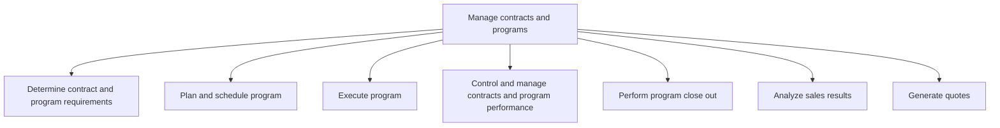

# Manage contracts and programs

> TODO: Business-as-Code definition for manage contracts and programs (aerospace-and-defense)

## Overview

Managing contracts with multiple suppliers. Supplier are dealt with as single entities in Select suppliers and develop/maintain contracts [10278].

## Process Hierarchy



## GraphDL

```yaml
manage:
  object: Contracts And Programs
  actor: TODO
  result: TODO
```

## Actions

| Action | Description |
|--------|-------------|
| TODO | TODO |

## Events

| Event | Description |
|-------|-------------|
| TODO | TODO |

## Searches

| Search | Description |
|--------|-------------|
| TODO | TODO |

## Process Flow


## RACI Matrix

| Activity | Responsible | Accountable | Consulted | Informed |
|----------|-------------|-------------|-----------|----------|
| TODO | TODO | TODO | TODO | TODO |

## Sub-Processes

| ID | Name | Description |
|----|------|-------------|
| 3.7.1 | Determine contract and program requirements | TODO |
| 3.7.2 | Plan and schedule program | TODO |
| 3.7.3 | Execute program | TODO |
| 3.7.4 | Control and manage contracts and program performance | TODO |
| 3.7.5 | Perform program close out | TODO |
| 3.7.6 | Analyze sales results | TODO |
| 3.7.7 | Generate quotes | Generating quotes for parts and services. Services include maintenance, parts repairs, digital, etc. |

## Related Processes

| Process | Relationship |
|---------|-------------|
| TODO | TODO |

## Related Departments

| Department | Role |
|-----------|------|
| TODO | TODO |

## Related Occupations

| Occupation | Involvement |
|-----------|-------------|
| TODO | TODO |

## KPIs

| KPI | Description | Unit |
|-----|-------------|------|
| TODO | TODO | TODO |

## Usage

```typescript
import { TODO } from '@headlessly/manage-contracts-and-programs'

const client = TODO()

// TODO: Example action calls
```
