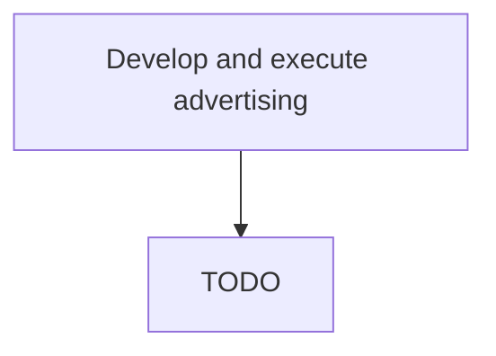

# Develop and execute advertising

> TODO: Business-as-Code definition for develop and execute advertising (airline)

## Overview

Developing and delivering advertising messages to the target audience, with the objective of influencing their purchasing decisions. Create advertising campaigns geared to specific offerings, and deliver through the media providers. Create content (textual and visual) that is highly contextualized to deliver the message in a specific manner. Consider enlisting specialized professional services.

## Process Hierarchy



## GraphDL

```yaml
develop:
  object: And Execute Advertising
  actor: TODO
  result: TODO
```

## Actions

| Action | Description |
|--------|-------------|
| TODO | TODO |

## Events

| Event | Description |
|-------|-------------|
| TODO | TODO |

## Searches

| Search | Description |
|--------|-------------|
| TODO | TODO |

## Process Flow


## RACI Matrix

| Activity | Responsible | Accountable | Consulted | Informed |
|----------|-------------|-------------|-----------|----------|
| TODO | TODO | TODO | TODO | TODO |

## Related Processes

| Process | Relationship |
|---------|-------------|
| TODO | TODO |

## Related Departments

| Department | Role |
|-----------|------|
| TODO | TODO |

## Related Occupations

| Occupation | Involvement |
|-----------|-------------|
| TODO | TODO |

## KPIs

| KPI | Description | Unit |
|-----|-------------|------|
| TODO | TODO | TODO |

## Usage

```typescript
import { TODO } from '@headlessly/develop-and-execute-advertising'

const client = TODO()

// TODO: Example action calls
```
