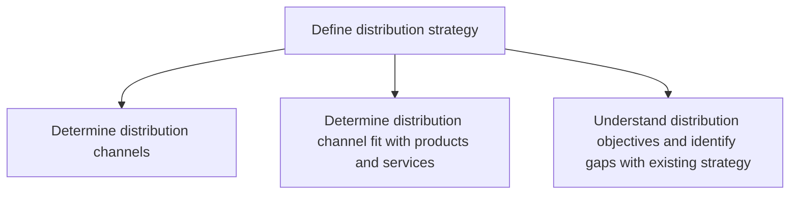

# Define distribution strategy

> TODO: Business-as-Code definition for define distribution strategy (airline)

## Overview

Determining distribution channels based on their fit with the products and services that are being offered by the airline. This also identifies the gaps in the existing strategy as determined by the distribution objectives.

## Process Hierarchy



## GraphDL

```yaml
define:
  object: Distribution Strategy
  actor: TODO
  result: TODO
```

## Actions

| Action | Description |
|--------|-------------|
| TODO | TODO |

## Events

| Event | Description |
|-------|-------------|
| TODO | TODO |

## Searches

| Search | Description |
|--------|-------------|
| TODO | TODO |

## Process Flow


## RACI Matrix

| Activity | Responsible | Accountable | Consulted | Informed |
|----------|-------------|-------------|-----------|----------|
| TODO | TODO | TODO | TODO | TODO |

## Sub-Processes

| ID | Name | Description |
|----|------|-------------|
| 3.4.2.1 | Determine distribution channels | TODO |
| 3.4.2.2 | Determine distribution channel fit with products and services | TODO |
| 3.4.2.3 | Understand distribution objectives and identify gaps with existing strategy | TODO |

## Related Processes

| Process | Relationship |
|---------|-------------|
| TODO | TODO |

## Related Departments

| Department | Role |
|-----------|------|
| TODO | TODO |

## Related Occupations

| Occupation | Involvement |
|-----------|-------------|
| TODO | TODO |

## KPIs

| KPI | Description | Unit |
|-----|-------------|------|
| TODO | TODO | TODO |

## Usage

```typescript
import { TODO } from '@headlessly/define-distribution-strategy'

const client = TODO()

// TODO: Example action calls
```
