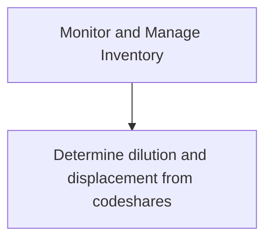

# Monitor and Manage Inventory

> TODO: Business-as-Code definition for monitor and manage inventory (airline)

## Overview

Monitoring routes to determine under-served and saturated markets and to determine dilution and displacement from codeshares.  A codeshare agreement allows an airline / carrier to sell seats on flights operated by another carrier along routes that are not served by the original carrier.

## Process Hierarchy



## GraphDL

```yaml
monitor:
  object: And Manage Inventory
  actor: TODO
  result: TODO
```

## Actions

| Action | Description |
|--------|-------------|
| TODO | TODO |

## Events

| Event | Description |
|-------|-------------|
| TODO | TODO |

## Searches

| Search | Description |
|--------|-------------|
| TODO | TODO |

## Process Flow


## RACI Matrix

| Activity | Responsible | Accountable | Consulted | Informed |
|----------|-------------|-------------|-----------|----------|
| TODO | TODO | TODO | TODO | TODO |

## Sub-Processes

| ID | Name | Description |
|----|------|-------------|
| 3.6.1.1 | Determine dilution and displacement from codeshares | TODO |

## Related Processes

| Process | Relationship |
|---------|-------------|
| TODO | TODO |

## Related Departments

| Department | Role |
|-----------|------|
| TODO | TODO |

## Related Occupations

| Occupation | Involvement |
|-----------|-------------|
| TODO | TODO |

## KPIs

| KPI | Description | Unit |
|-----|-------------|------|
| TODO | TODO | TODO |

## Usage

```typescript
import { TODO } from '@headlessly/monitor-and-manage-inventory'

const client = TODO()

// TODO: Example action calls
```
