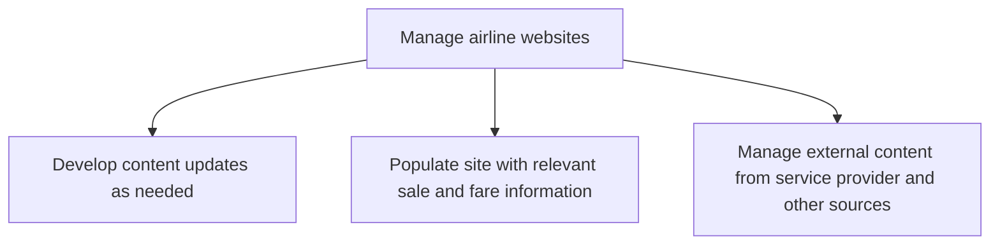

# Manage airline websites

> TODO: Business-as-Code definition for manage airline websites (airline)

## Overview

Developing content updates and populating the website with relevant sale and fare information.  Managing external content from service providers and other sources is another key activity to ensure that the site is relevant, accurate and up to date.

## Process Hierarchy



## GraphDL

```yaml
manage:
  object: Airline Websites
  actor: TODO
  result: TODO
```

## Actions

| Action | Description |
|--------|-------------|
| TODO | TODO |

## Events

| Event | Description |
|-------|-------------|
| TODO | TODO |

## Searches

| Search | Description |
|--------|-------------|
| TODO | TODO |

## Process Flow


## RACI Matrix

| Activity | Responsible | Accountable | Consulted | Informed |
|----------|-------------|-------------|-----------|----------|
| TODO | TODO | TODO | TODO | TODO |

## Sub-Processes

| ID | Name | Description |
|----|------|-------------|
| 3.6.5.1 | Develop content updates as needed | TODO |
| 3.6.5.2 | Populate site with relevant sale and fare information | TODO |
| 3.6.5.3 | Manage external content from service provider and other sources | TODO |

## Related Processes

| Process | Relationship |
|---------|-------------|
| TODO | TODO |

## Related Departments

| Department | Role |
|-----------|------|
| TODO | TODO |

## Related Occupations

| Occupation | Involvement |
|-----------|-------------|
| TODO | TODO |

## KPIs

| KPI | Description | Unit |
|-----|-------------|------|
| TODO | TODO | TODO |

## Usage

```typescript
import { TODO } from '@headlessly/manage-airline-websites'

const client = TODO()

// TODO: Example action calls
```
