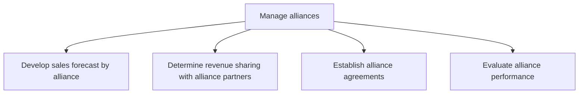

# Manage alliances

> TODO: Business-as-Code definition for manage alliances (airline)

## Overview

Managing alliances to assist the airline in augmenting capacity and/or allowing the carrier to cover a larger area.  Sales forecasts are developed for each alliance and revenue sharing with alliance partners is determined.  Thereafter, agreements are established and performance evaluated.

## Process Hierarchy



## GraphDL

```yaml
manage:
  object: Alliances
  actor: TODO
  result: TODO
```

## Actions

| Action | Description |
|--------|-------------|
| TODO | TODO |

## Events

| Event | Description |
|-------|-------------|
| TODO | TODO |

## Searches

| Search | Description |
|--------|-------------|
| TODO | TODO |

## Process Flow


## RACI Matrix

| Activity | Responsible | Accountable | Consulted | Informed |
|----------|-------------|-------------|-----------|----------|
| TODO | TODO | TODO | TODO | TODO |

## Sub-Processes

| ID | Name | Description |
|----|------|-------------|
| 3.6.9.1 | Develop sales forecast by alliance | TODO |
| 3.6.9.2 | Determine revenue sharing with alliance partners | TODO |
| 3.6.9.3 | Establish alliance agreements | TODO |
| 3.6.9.4 | Evaluate alliance performance | TODO |

## Related Processes

| Process | Relationship |
|---------|-------------|
| TODO | TODO |

## Related Departments

| Department | Role |
|-----------|------|
| TODO | TODO |

## Related Occupations

| Occupation | Involvement |
|-----------|-------------|
| TODO | TODO |

## KPIs

| KPI | Description | Unit |
|-----|-------------|------|
| TODO | TODO | TODO |

## Usage

```typescript
import { TODO } from '@headlessly/manage-alliances'

const client = TODO()

// TODO: Example action calls
```
