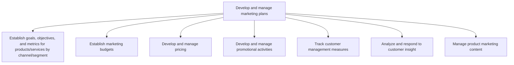

# Develop and manage marketing plans

> TODO: Business-as-Code definition for develop and manage marketing plans (automotive)

## Overview

Creating specific plans to market offerings to customers. Manage and measure marketing and customers along with any supporting materials.

## Process Hierarchy



## GraphDL

```yaml
develop:
  object: And Manage Marketing Plans
  actor: TODO
  result: TODO
```

## Actions

| Action | Description |
|--------|-------------|
| TODO | TODO |

## Events

| Event | Description |
|-------|-------------|
| TODO | TODO |

## Searches

| Search | Description |
|--------|-------------|
| TODO | TODO |

## Process Flow


## RACI Matrix

| Activity | Responsible | Accountable | Consulted | Informed |
|----------|-------------|-------------|-----------|----------|
| TODO | TODO | TODO | TODO | TODO |

## Sub-Processes

| ID | Name | Description |
|----|------|-------------|
| 3.3.1 | Establish goals, objectives, and metrics for products/services by channel/segment | Determining what to achieve by marketing. Create qualitative and quantitative targets. Establish met |
| 3.3.2 | Establish marketing budgets | Creating a budget for the organization's marketing efforts, in line with the business-wide strategic |
| 3.3.3 | Develop and manage pricing | Determining and maintaining a pricing mechanism based on forecasted sales and that enables a pricing |
| 3.3.4 | Develop and manage promotional activities | Conceptualizing, testing, and executing product/service/brand promotions. Once a promotion has launc |
| 3.3.5 | Track customer management measures | Collating all customer-centered metrics. The objective is to create a big-picture view of the custom |
| 3.3.6 | Analyze and respond to customer insight | Reviewing and responding to customer feedback. Create tickets to initiate bug fixes or to propose fe |
| 3.3.7 | Manage product marketing content | Creating descriptions of products that are promotional and informative in content in order to initia |

## Related Processes

| Process | Relationship |
|---------|-------------|
| TODO | TODO |

## Related Departments

| Department | Role |
|-----------|------|
| TODO | TODO |

## Related Occupations

| Occupation | Involvement |
|-----------|-------------|
| TODO | TODO |

## KPIs

| KPI | Description | Unit |
|-----|-------------|------|
| TODO | TODO | TODO |

## Usage

```typescript
import { TODO } from '@headlessly/develop-and-manage-marketing-plans'

const client = TODO()

// TODO: Example action calls
```
