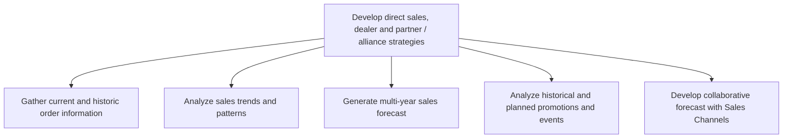

# Develop direct sales, dealer and partner / alliance strategies

> TODO: Business-as-Code definition for develop direct sales, dealer and partner / alliance strategies (automotive)

## Overview

TODO: Add process overview

## Process Hierarchy



## GraphDL

```yaml
develop:
  object: Direct Sales, Dealer And Partner / Alliance Strategies
  actor: TODO
  result: TODO
```

## Actions

| Action | Description |
|--------|-------------|
| TODO | TODO |

## Events

| Event | Description |
|-------|-------------|
| TODO | TODO |

## Searches

| Search | Description |
|--------|-------------|
| TODO | TODO |

## Process Flow


## RACI Matrix

| Activity | Responsible | Accountable | Consulted | Informed |
|----------|-------------|-------------|-----------|----------|
| TODO | TODO | TODO | TODO | TODO |

## Sub-Processes

| ID | Name | Description |
|----|------|-------------|
| 3.4.1.1 | Gather current and historic order information | Gathering all information about sales orders into an index. Create a directory of all sales orders,  |
| 3.4.1.2 | Analyze sales trends and patterns | Analyzing sales order data to identify patterns in order to capitalize on emerging trends in the ind |
| 3.4.1.3 | Generate multi-year sales forecast | Calculating the future demand for the organization's products/services. Use the trends and patterns  |
| 3.4.1.4 | Analyze historical and planned promotions and events | Reviewing promotional activities' effect on the sales orders. Analyze all promotional events and cam |
| 3.4.1.5 | Develop collaborative forecast with Sales Channels | TODO |

## Related Processes

| Process | Relationship |
|---------|-------------|
| TODO | TODO |

## Related Departments

| Department | Role |
|-----------|------|
| TODO | TODO |

## Related Occupations

| Occupation | Involvement |
|-----------|-------------|
| TODO | TODO |

## KPIs

| KPI | Description | Unit |
|-----|-------------|------|
| TODO | TODO | TODO |

## Usage

```typescript
import { TODO } from '@headlessly/develop-direct-sales,-dealer-and-partner-/-alliance-strategies'

const client = TODO()

// TODO: Example action calls
```
