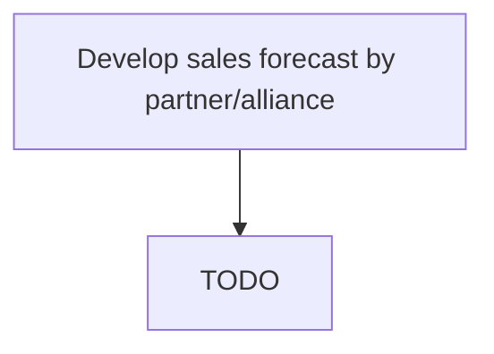

# Develop sales forecast by partner/alliance

> TODO: Business-as-Code definition for develop sales forecast by partner/alliance (automotive)

## Overview

Estimating the sales enabled by the partners/alliances. Bear in mind any historical information on this subject. Analyze the capabilities of these partners, their extent of customer engagement, reputation, history with selling similar products/services, etc.

## Process Hierarchy



## GraphDL

```yaml
develop:
  object: Sales Forecast By Partner/alliance
  actor: TODO
  result: TODO
```

## Actions

| Action | Description |
|--------|-------------|
| TODO | TODO |

## Events

| Event | Description |
|-------|-------------|
| TODO | TODO |

## Searches

| Search | Description |
|--------|-------------|
| TODO | TODO |

## Process Flow


## RACI Matrix

| Activity | Responsible | Accountable | Consulted | Informed |
|----------|-------------|-------------|-----------|----------|
| TODO | TODO | TODO | TODO | TODO |

## Related Processes

| Process | Relationship |
|---------|-------------|
| TODO | TODO |

## Related Departments

| Department | Role |
|-----------|------|
| TODO | TODO |

## Related Occupations

| Occupation | Involvement |
|-----------|-------------|
| TODO | TODO |

## KPIs

| KPI | Description | Unit |
|-----|-------------|------|
| TODO | TODO | TODO |

## Usage

```typescript
import { TODO } from '@headlessly/develop-sales-forecast-by-partner/alliance'

const client = TODO()

// TODO: Example action calls
```
