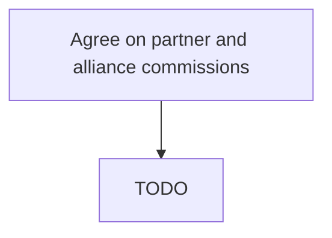

# Agree on partner and alliance commissions

> TODO: Business-as-Code definition for agree on partner and alliance commissions (automotive)

## Overview

Agreeing to a compensation structure for awarding commissions to the organization's partners/alliances. Select a methodology for awarding commissions, such as offering commissions for units sold per quarter or as a percentage of the margin over the cost of production. Set equitable figures for the direct compensation.

## Process Hierarchy



## GraphDL

```yaml
agree:
  object: On Partner And Alliance Commissions
  actor: TODO
  result: TODO
```

## Actions

| Action | Description |
|--------|-------------|
| TODO | TODO |

## Events

| Event | Description |
|-------|-------------|
| TODO | TODO |

## Searches

| Search | Description |
|--------|-------------|
| TODO | TODO |

## Process Flow


## RACI Matrix

| Activity | Responsible | Accountable | Consulted | Informed |
|----------|-------------|-------------|-----------|----------|
| TODO | TODO | TODO | TODO | TODO |

## Related Processes

| Process | Relationship |
|---------|-------------|
| TODO | TODO |

## Related Departments

| Department | Role |
|-----------|------|
| TODO | TODO |

## Related Occupations

| Occupation | Involvement |
|-----------|-------------|
| TODO | TODO |

## KPIs

| KPI | Description | Unit |
|-----|-------------|------|
| TODO | TODO | TODO |

## Usage

```typescript
import { TODO } from '@headlessly/agree-on-partner-and-alliance-commissions'

const client = TODO()

// TODO: Example action calls
```
