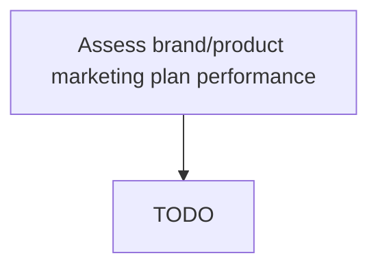

# Assess brand/product marketing plan performance

> TODO: Business-as-Code definition for assess brand/product marketing plan performance (automotive)

## Overview

Examining the performance of all marketing efforts, across multiple parameters in order create an optimal marketing mix. Examine these programs on various aspects, such as return on investment, brand penetration, brand sentiment, and brand impact. Leverage focus groups, client feedback, customer engagement tracking, analytics over customer decisions, activity over the marketing channels employed, etc. Survey the performance of all marketing programs.

## Process Hierarchy



## GraphDL

```yaml
assess:
  object: Brand/product Marketing Plan Performance
  actor: TODO
  result: TODO
```

## Actions

| Action | Description |
|--------|-------------|
| TODO | TODO |

## Events

| Event | Description |
|-------|-------------|
| TODO | TODO |

## Searches

| Search | Description |
|--------|-------------|
| TODO | TODO |

## Process Flow


## RACI Matrix

| Activity | Responsible | Accountable | Consulted | Informed |
|----------|-------------|-------------|-----------|----------|
| TODO | TODO | TODO | TODO | TODO |

## Related Processes

| Process | Relationship |
|---------|-------------|
| TODO | TODO |

## Related Departments

| Department | Role |
|-----------|------|
| TODO | TODO |

## Related Occupations

| Occupation | Involvement |
|-----------|-------------|
| TODO | TODO |

## KPIs

| KPI | Description | Unit |
|-----|-------------|------|
| TODO | TODO | TODO |

## Usage

```typescript
import { TODO } from '@headlessly/assess-brand/product-marketing-plan-performance'

const client = TODO()

// TODO: Example action calls
```
