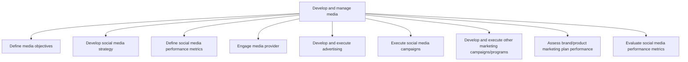

# Develop and manage media

> TODO: Business-as-Code definition for develop and manage media (automotive)

## Overview

Conceptualizing, creating, and coordinating the execution of marketing programs. Account for all marketing activities. Clearly define objectives for using various marketing channels. Identify target audiences at a micro-level. Design the sales messages. Package these messages into advertising and other marketing campaigns. Enroll service providers. Determine the choice of media channels on the basis of Analyze customer and market intelligence analysis [10106] and the Define the channel strategy [10122].

## Process Hierarchy



## GraphDL

```yaml
develop:
  object: And Manage Media
  actor: TODO
  result: TODO
```

## Actions

| Action | Description |
|--------|-------------|
| TODO | TODO |

## Events

| Event | Description |
|-------|-------------|
| TODO | TODO |

## Searches

| Search | Description |
|--------|-------------|
| TODO | TODO |

## Process Flow


## RACI Matrix

| Activity | Responsible | Accountable | Consulted | Informed |
|----------|-------------|-------------|-----------|----------|
| TODO | TODO | TODO | TODO | TODO |

## Sub-Processes

| ID | Name | Description |
|----|------|-------------|
| 3.5.6.1 | Define media objectives | Creating a set of general objectives that the organization aims to achieve through the use of variou |
| 3.5.6.2 | Develop social media strategy | TODO |
| 3.5.6.3 | Define social media performance metrics | TODO |
| 3.5.6.4 | Engage media provider | Enrolling the services of certain media providers, who employ marketing channels that are appropriat |
| 3.5.6.5 | Develop and execute advertising | Developing and delivering advertising messages to the target audience, with the objective of influen |
| 3.5.6.6 | Execute social media campaigns | TODO |
| 3.5.6.7 | Develop and execute other marketing campaigns/programs | Designing and executing additional marketing campaigns, besides advertising, including undercover ma |
| 3.5.6.8 | Assess brand/product marketing plan performance | Examining the performance of all marketing efforts, across multiple parameters in order create an op |
| 3.5.6.9 | Evaluate social media performance metrics | TODO |

## Related Processes

| Process | Relationship |
|---------|-------------|
| TODO | TODO |

## Related Departments

| Department | Role |
|-----------|------|
| TODO | TODO |

## Related Occupations

| Occupation | Involvement |
|-----------|-------------|
| TODO | TODO |

## KPIs

| KPI | Description | Unit |
|-----|-------------|------|
| TODO | TODO | TODO |

## Usage

```typescript
import { TODO } from '@headlessly/develop-and-manage-media'

const client = TODO()

// TODO: Example action calls
```
