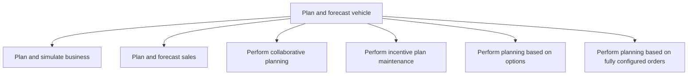

# Plan and forecast vehicle

> TODO: Business-as-Code definition for plan and forecast vehicle (automotive)

## Overview

This process group includes the processes to plan and simulate business, plan and forecast sales, perform collaborative planning, maintain incentive plans, and conduct planning based on options as well as on fully configured orders.

## Process Hierarchy



## GraphDL

```yaml
plan:
  object: And Forecast Vehicle
  actor: TODO
  result: TODO
```

## Actions

| Action | Description |
|--------|-------------|
| TODO | TODO |

## Events

| Event | Description |
|-------|-------------|
| TODO | TODO |

## Searches

| Search | Description |
|--------|-------------|
| TODO | TODO |

## Process Flow


## RACI Matrix

| Activity | Responsible | Accountable | Consulted | Informed |
|----------|-------------|-------------|-----------|----------|
| TODO | TODO | TODO | TODO | TODO |

## Sub-Processes

| ID | Name | Description |
|----|------|-------------|
| 3.6.1 | Plan and simulate business | TODO |
| 3.6.2 | Plan and forecast sales | TODO |
| 3.6.3 | Perform collaborative planning | TODO |
| 3.6.4 | Perform incentive plan maintenance | TODO |
| 3.6.5 | Perform planning based on options | TODO |
| 3.6.6 | Perform planning based on fully configured orders | TODO |

## Related Processes

| Process | Relationship |
|---------|-------------|
| TODO | TODO |

## Related Departments

| Department | Role |
|-----------|------|
| TODO | TODO |

## Related Occupations

| Occupation | Involvement |
|-----------|-------------|
| TODO | TODO |

## KPIs

| KPI | Description | Unit |
|-----|-------------|------|
| TODO | TODO | TODO |

## Usage

```typescript
import { TODO } from '@headlessly/plan-and-forecast-vehicle'

const client = TODO()

// TODO: Example action calls
```
