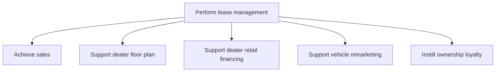

# Perform lease management

> TODO: Business-as-Code definition for perform lease management (automotive)

## Overview

A lease is an agreement between a seller and a customer, in terms of which the customer is given use of a vehicle for an agreed lease payment amount over a fixed period of time. The processes associated with the OEM performing lease management in this process group include achieving sales; supporting dealer floor plans, retail financing and vehicle remarketing; and instilling ownership loyalty.

## Process Hierarchy



## GraphDL

```yaml
perform:
  object: Lease Management
  actor: TODO
  result: TODO
```

## Actions

| Action | Description |
|--------|-------------|
| TODO | TODO |

## Events

| Event | Description |
|-------|-------------|
| TODO | TODO |

## Searches

| Search | Description |
|--------|-------------|
| TODO | TODO |

## Process Flow


## RACI Matrix

| Activity | Responsible | Accountable | Consulted | Informed |
|----------|-------------|-------------|-----------|----------|
| TODO | TODO | TODO | TODO | TODO |

## Sub-Processes

| ID | Name | Description |
|----|------|-------------|
| 3.7.1 | Achieve sales | TODO |
| 3.7.2 | Support dealer floor plan | TODO |
| 3.7.3 | Support dealer retail financing | TODO |
| 3.7.4 | Support vehicle remarketing | TODO |
| 3.7.5 | Instill ownership loyalty | TODO |

## Related Processes

| Process | Relationship |
|---------|-------------|
| TODO | TODO |

## Related Departments

| Department | Role |
|-----------|------|
| TODO | TODO |

## Related Occupations

| Occupation | Involvement |
|-----------|-------------|
| TODO | TODO |

## KPIs

| KPI | Description | Unit |
|-----|-------------|------|
| TODO | TODO | TODO |

## Usage

```typescript
import { TODO } from '@headlessly/perform-lease-management'

const client = TODO()

// TODO: Example action calls
```
