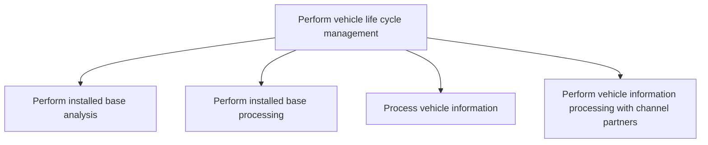

# Perform vehicle life cycle management

> TODO: Business-as-Code definition for perform vehicle life cycle management (automotive)

## Overview

The OEM will perform installed base analysis and processing (the installed base is the number of units that have been sold within a particular period), will process vehicle information, and finally perform vehicle information processing with channel partners.

## Process Hierarchy



## GraphDL

```yaml
perform:
  object: Vehicle Life Cycle Management
  actor: TODO
  result: TODO
```

## Actions

| Action | Description |
|--------|-------------|
| TODO | TODO |

## Events

| Event | Description |
|-------|-------------|
| TODO | TODO |

## Searches

| Search | Description |
|--------|-------------|
| TODO | TODO |

## Process Flow


## RACI Matrix

| Activity | Responsible | Accountable | Consulted | Informed |
|----------|-------------|-------------|-----------|----------|
| TODO | TODO | TODO | TODO | TODO |

## Sub-Processes

| ID | Name | Description |
|----|------|-------------|
| 3.8.1 | Perform installed base analysis | TODO |
| 3.8.2 | Perform installed base processing | TODO |
| 3.8.3 | Process vehicle information | TODO |
| 3.8.4 | Perform vehicle information processing with channel partners | TODO |

## Related Processes

| Process | Relationship |
|---------|-------------|
| TODO | TODO |

## Related Departments

| Department | Role |
|-----------|------|
| TODO | TODO |

## Related Occupations

| Occupation | Involvement |
|-----------|-------------|
| TODO | TODO |

## KPIs

| KPI | Description | Unit |
|-----|-------------|------|
| TODO | TODO | TODO |

## Usage

```typescript
import { TODO } from '@headlessly/perform-vehicle-life-cycle-management'

const client = TODO()

// TODO: Example action calls
```
