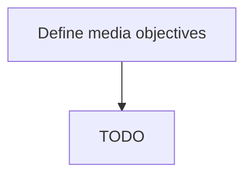

# Define media objectives

> TODO: Business-as-Code definition for define media objectives (broadcasting)

## Overview

Creating a set of general objectives that the organization aims to achieve through the use of various media vehicles, for its marketing efforts. Outline the intention and purpose in using certain media channels for the marketing and promotion of its products/services. Create a media plan with specific goals for media channels.

## Process Hierarchy



## GraphDL

```yaml
define:
  object: Media Objectives
  actor: TODO
  result: TODO
```

## Actions

| Action | Description |
|--------|-------------|
| TODO | TODO |

## Events

| Event | Description |
|-------|-------------|
| TODO | TODO |

## Searches

| Search | Description |
|--------|-------------|
| TODO | TODO |

## Process Flow


## RACI Matrix

| Activity | Responsible | Accountable | Consulted | Informed |
|----------|-------------|-------------|-----------|----------|
| TODO | TODO | TODO | TODO | TODO |

## Related Processes

| Process | Relationship |
|---------|-------------|
| TODO | TODO |

## Related Departments

| Department | Role |
|-----------|------|
| TODO | TODO |

## Related Occupations

| Occupation | Involvement |
|-----------|-------------|
| TODO | TODO |

## KPIs

| KPI | Description | Unit |
|-----|-------------|------|
| TODO | TODO | TODO |

## Usage

```typescript
import { TODO } from '@headlessly/define-media-objectives'

const client = TODO()

// TODO: Example action calls
```
