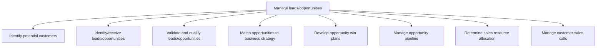

# Manage leads/opportunities

> TODO: Business-as-Code definition for manage leads/opportunities (broadcasting)

## Overview

The Generate leads process involves identifying viable customers based on strategy and market research conducted in process group 3.1 Understand markets, customers, and capabilities. This process covers the discovery of leads, whether this process is accomplished through an IT application, cold calling, reference/network development, or other sales methodology. Every organization can usually generate leads, but it takes extra work to identify quality leads. Develop a well-defined scoring model to determine which leads to prioritize.

## Process Hierarchy



## GraphDL

```yaml
manage:
  object: Leads/opportunities
  actor: TODO
  result: TODO
```

## Actions

| Action | Description |
|--------|-------------|
| TODO | TODO |

## Events

| Event | Description |
|-------|-------------|
| TODO | TODO |

## Searches

| Search | Description |
|--------|-------------|
| TODO | TODO |

## Process Flow


## RACI Matrix

| Activity | Responsible | Accountable | Consulted | Informed |
|----------|-------------|-------------|-----------|----------|
| TODO | TODO | TODO | TODO | TODO |

## Sub-Processes

| ID | Name | Description |
|----|------|-------------|
| 3.5.1.1 | Identify potential customers | Identifying people who can be converted into customers. Leverage personal and professional networks, |
| 3.5.1.2 | Identify/receive leads/opportunities | Qualifying the prospective customers into credible leads by gauging their behavior against the organ |
| 3.5.1.3 | Validate and qualify leads/opportunities | Reviewing the set of potential customers and sales opportunities. Approve the leads that meet compan |
| 3.5.1.4 | Match opportunities to business strategy | Aligning sales leads with business objectives. |
| 3.5.1.5 | Develop opportunity win plans | Creating plans about how to close leads and win sales opportunities. |
| 3.5.1.6 | Manage opportunity pipeline | Overseeing and planning the acquisition of new customers. |
| 3.5.1.7 | Determine sales resource allocation | Planning the distribution of personnel across various sales functions. Match the capabilities of ind |
| 3.5.1.8 | Manage customer sales calls | Managing the entire sales process, from using leads to open sales to closing sales and creating reco |

## Related Processes

| Process | Relationship |
|---------|-------------|
| TODO | TODO |

## Related Departments

| Department | Role |
|-----------|------|
| TODO | TODO |

## Related Occupations

| Occupation | Involvement |
|-----------|-------------|
| TODO | TODO |

## KPIs

| KPI | Description | Unit |
|-----|-------------|------|
| TODO | TODO | TODO |

## Usage

```typescript
import { TODO } from '@headlessly/manage-leads/opportunities'

const client = TODO()

// TODO: Example action calls
```
