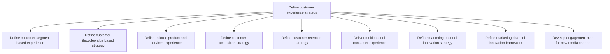

# Define customer experience strategy

> TODO: Business-as-Code definition for define customer experience strategy (consumer-electronics)

## Overview

TODO: Add process overview

## Process Hierarchy



## GraphDL

```yaml
define:
  object: Customer Experience Strategy
  actor: TODO
  result: TODO
```

## Actions

| Action | Description |
|--------|-------------|
| TODO | TODO |

## Events

| Event | Description |
|-------|-------------|
| TODO | TODO |

## Searches

| Search | Description |
|--------|-------------|
| TODO | TODO |

## Process Flow


## RACI Matrix

| Activity | Responsible | Accountable | Consulted | Informed |
|----------|-------------|-------------|-----------|----------|
| TODO | TODO | TODO | TODO | TODO |

## Sub-Processes

| ID | Name | Description |
|----|------|-------------|
| 3.2.8.1 | Define customer segment based experience | TODO |
| 3.2.8.2 | Define customer lifecycle/value based strategy | TODO |
| 3.2.8.3 | Define tailored product and services experience | TODO |
| 3.2.8.4 | Define customer acquisition strategy | TODO |
| 3.2.8.5 | Define customer retention strategy | TODO |
| 3.2.8.6 | Deliver multichannel consumer experience | TODO |
| 3.2.8.7 | Define marketing channel innovation strategy | TODO |
| 3.2.8.8 | Define marketing channel innovation framework | TODO |
| 3.2.8.9 | Develop engagement plan for new media channel | TODO |

## Related Processes

| Process | Relationship |
|---------|-------------|
| TODO | TODO |

## Related Departments

| Department | Role |
|-----------|------|
| TODO | TODO |

## Related Occupations

| Occupation | Involvement |
|-----------|-------------|
| TODO | TODO |

## KPIs

| KPI | Description | Unit |
|-----|-------------|------|
| TODO | TODO | TODO |

## Usage

```typescript
import { TODO } from '@headlessly/define-customer-experience-strategy'

const client = TODO()

// TODO: Example action calls
```
