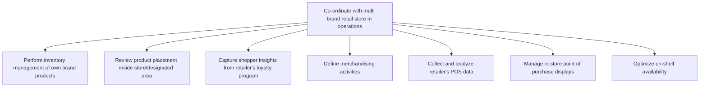

# Co-ordinate with multi brand retail store in operations

> TODO: Business-as-Code definition for co-ordinate with multi brand retail store in operations (consumer-electronics)

## Overview

TODO: Add process overview

## Process Hierarchy



## GraphDL

```yaml
co-ordinate:
  object: With Multi Brand Retail Store In Operations
  actor: TODO
  result: TODO
```

## Actions

| Action | Description |
|--------|-------------|
| TODO | TODO |

## Events

| Event | Description |
|-------|-------------|
| TODO | TODO |

## Searches

| Search | Description |
|--------|-------------|
| TODO | TODO |

## Process Flow


## RACI Matrix

| Activity | Responsible | Accountable | Consulted | Informed |
|----------|-------------|-------------|-----------|----------|
| TODO | TODO | TODO | TODO | TODO |

## Sub-Processes

| ID | Name | Description |
|----|------|-------------|
| 3.5.6.1 | Perform inventory management of own brand products | TODO |
| 3.5.6.2 | Review product placement inside store/designated area | TODO |
| 3.5.6.3 | Capture shopper insights from retailer's loyalty program | TODO |
| 3.5.6.4 | Define merchandising activities | TODO |
| 3.5.6.5 | Collect and analyze retailer's POS data | TODO |
| 3.5.6.6 | Manage in-store point of purchase displays | TODO |
| 3.5.6.7 | Optimize on-shelf availability | TODO |

## Related Processes

| Process | Relationship |
|---------|-------------|
| TODO | TODO |

## Related Departments

| Department | Role |
|-----------|------|
| TODO | TODO |

## Related Occupations

| Occupation | Involvement |
|-----------|-------------|
| TODO | TODO |

## KPIs

| KPI | Description | Unit |
|-----|-------------|------|
| TODO | TODO | TODO |

## Usage

```typescript
import { TODO } from '@headlessly/co-ordinate-with-multi-brand-retail-store-in-operations'

const client = TODO()

// TODO: Example action calls
```
